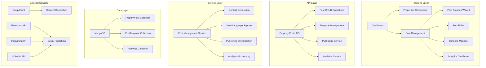

# 🏗️ **ARCHITECTURAL REVIEW: Multi-Post Management System**

## 📋 **Executive Summary**

This document outlines the architectural design for implementing a comprehensive multi-post management system that allows real estate agents to create, manage, and publish multiple posts per property across multiple languages and social media channels.

## 🎯 **Business Requirements**

### **Core Functionality**
- **Multi-Post Support**: Each property can have multiple posts (draft, published, archived)
- **Multi-Language Support**: Posts in 10+ Indian languages + English
- **Multi-Channel Publishing**: Facebook, Instagram, LinkedIn, Website, Email
- **AI Content Generation**: Smart content creation with customizable prompts
- **Agent Editing**: Full editing capabilities for AI-generated content
- **Template System**: Reusable post templates for different property types
- **Analytics & Performance**: Post-level and property-level performance tracking

### **User Stories**
- As an agent, I want to create multiple posts for a single property
- As an agent, I want to edit AI-generated content before publishing
- As an agent, I want to schedule posts for different times
- As an agent, I want to see performance analytics for each post
- As an agent, I want to use templates for consistent branding

## 🏛️ **System Architecture**

### **High-Level Architecture**



### **Database Schema Design**

#### **PropertyPost Collection**
```json
{
  "_id": "ObjectId",
  "property_id": "ObjectId",
  "agent_id": "string",
  "title": "string",
  "content": "string",
  "language": "string",
  "template_id": "ObjectId",
  "status": "draft|published|archived",
  "channels": ["facebook", "instagram", "linkedin", "website", "email"],
  "scheduled_at": "datetime",
  "published_at": "datetime",
  "facebook_post_id": "string",
  "instagram_post_id": "string",
  "linkedin_post_id": "string",
  "website_post_id": "string",
  "email_campaign_id": "string",
  "ai_generated": "boolean",
  "ai_prompt": "string",
  "version": "number",
  "created_at": "datetime",
  "updated_at": "datetime",
  "analytics": {
    "views": "number",
    "likes": "number",
    "shares": "number",
    "comments": "number",
    "clicks": "number",
    "conversions": "number"
  }
}
```

#### **PostTemplate Collection**
```json
{
  "_id": "ObjectId",
  "name": "string",
  "description": "string",
  "property_type": "string",
  "language": "string",
  "template": "string",
  "variables": ["string"],
  "channels": ["string"],
  "is_active": "boolean",
  "created_by": "string",
  "created_at": "datetime",
  "updated_at": "datetime"
}
```

## 🔧 **Technical Implementation**

### **Frontend Architecture**

#### **Component Hierarchy**
```
Dashboard
├── Properties (Enhanced)
│   ├── PropertyCard
│   └── PostCountBadge
├── Post Management (New)
│   ├── PostManagementDashboard
│   ├── PropertyPostsList
│   ├── PostCreationWizard
│   ├── PostEditor
│   ├── TemplateManager
│   └── AnalyticsDashboard
└── Navigation (Enhanced)
    └── PostManagementLink
```

#### **State Management**
- **Post State**: Redux/Zustand for post management
- **Template State**: Local state with API caching
- **Analytics State**: Real-time updates with WebSocket
- **UI State**: React Context for modal/editor states

### **Backend Architecture**

#### **API Endpoints**
```python
# Post Management
POST   /api/v1/posts                    # Create new post
GET    /api/v1/posts                    # List posts with filters
GET    /api/v1/posts/{post_id}          # Get specific post
PUT    /api/v1/posts/{post_id}          # Update post
DELETE /api/v1/posts/{post_id}          # Delete post

# Template Management
POST   /api/v1/templates                # Create template
GET    /api/v1/templates                # List templates
PUT    /api/v1/templates/{template_id}  # Update template
DELETE /api/v1/templates/{template_id}  # Delete template

# Publishing
POST   /api/v1/posts/{post_id}/publish  # Publish post
POST   /api/v1/posts/{post_id}/unpublish # Unpublish post
GET    /api/v1/posts/{post_id}/status   # Get publishing status

# Analytics
GET    /api/v1/posts/{post_id}/analytics # Get post analytics
GET    /api/v1/properties/{property_id}/posts/analytics # Get property analytics
```

#### **Service Layer**
```python
class PostManagementService:
    async def create_post(self, post_data: PostCreateRequest) -> PostResponse
    async def get_posts(self, filters: PostFilters) -> List[PostResponse]
    async def update_post(self, post_id: str, updates: PostUpdateRequest) -> PostResponse
    async def delete_post(self, post_id: str) -> bool
    async def publish_post(self, post_id: str, channels: List[str]) -> PublishingResult
    async def get_analytics(self, post_id: str) -> AnalyticsResponse

class TemplateService:
    async def create_template(self, template_data: TemplateCreateRequest) -> TemplateResponse
    async def get_templates(self, filters: TemplateFilters) -> List[TemplateResponse]
    async def update_template(self, template_id: str, updates: TemplateUpdateRequest) -> TemplateResponse
    async def delete_template(self, template_id: str) -> bool

class PublishingService:
    async def publish_to_facebook(self, post: PostResponse) -> PublishingResult
    async def publish_to_instagram(self, post: PostResponse) -> PublishingResult
    async def publish_to_linkedin(self, post: PostResponse) -> PublishingResult
    async def publish_to_website(self, post: PostResponse) -> PublishingResult
    async def send_email_campaign(self, post: PostResponse) -> PublishingResult
```

### **AI Integration**

#### **Content Generation Pipeline**
```python
class AIContentGenerator:
    async def generate_content(self, property_data: dict, template: str, language: str) -> str:
        # 1. Load property data
        # 2. Apply template
        # 3. Generate content using Groq API
        # 4. Apply language-specific formatting
        # 5. Return generated content
    
    async def enhance_content(self, content: str, enhancements: List[str]) -> str:
        # 1. Analyze content
        # 2. Apply enhancements (SEO, engagement, etc.)
        # 3. Return enhanced content
```

#### **Multi-Language Support**
- **Language Detection**: Automatic detection of content language
- **Translation Service**: Integration with translation APIs
- **Cultural Adaptation**: Language-specific formatting and cultural context
- **Template Localization**: Templates adapted for each language

## 🔒 **Security & Performance**

### **Security Measures**
- **Authentication**: JWT-based authentication for all API endpoints
- **Authorization**: Role-based access control (agent, admin, viewer)
- **Data Validation**: Pydantic schemas for all input validation
- **Rate Limiting**: API rate limiting to prevent abuse
- **Content Sanitization**: XSS protection for user-generated content

### **Performance Optimizations**
- **Database Indexing**: Optimized indexes for common queries
- **Caching**: Redis caching for templates and analytics
- **Pagination**: Efficient pagination for large datasets
- **Lazy Loading**: Component-level lazy loading
- **CDN**: Static asset delivery via CDN

### **Scalability Considerations**
- **Horizontal Scaling**: Stateless API design
- **Database Sharding**: Property-based sharding strategy
- **Queue System**: Celery for background tasks
- **Monitoring**: Comprehensive logging and monitoring

## 📊 **Analytics & Monitoring**

### **Metrics Collection**
- **Post Performance**: Views, likes, shares, comments, clicks
- **Property Performance**: Aggregate metrics across all posts
- **Agent Performance**: Individual agent analytics
- **System Performance**: API response times, error rates

### **Real-time Updates**
- **WebSocket**: Real-time analytics updates
- **Event Streaming**: Kafka for event-driven updates
- **Dashboard Refresh**: Automatic dashboard updates

## 🚀 **Implementation Timeline**

### **Phase 1: Foundation (Weeks 1-2)**
- Database schema implementation
- Basic API endpoints
- Frontend component structure
- Authentication integration

### **Phase 2: Core Features (Weeks 3-4)**
- Post CRUD operations
- Template management
- Basic publishing workflow
- Multi-language support

### **Phase 3: Advanced Features (Weeks 5-6)**
- AI content generation
- Advanced editing capabilities
- Analytics dashboard
- Performance optimizations

### **Phase 4: Testing & Deployment (Weeks 7-8)**
- Comprehensive testing
- Performance testing
- Security testing
- Production deployment

## 🔄 **Migration Strategy**

### **Existing Code Refactoring**
1. **Extract Common Logic**: Move shared functionality to services
2. **Update Schemas**: Modify existing schemas to support multi-post
3. **API Versioning**: Maintain backward compatibility
4. **Gradual Migration**: Phased rollout of new features

### **Data Migration**
1. **Schema Updates**: Update existing collections
2. **Data Transformation**: Convert existing data to new format
3. **Validation**: Ensure data integrity
4. **Rollback Plan**: Prepare rollback procedures

## 🧪 **Testing Strategy**

### **Unit Testing**
- Service layer testing
- API endpoint testing
- Component testing
- Utility function testing

### **Integration Testing**
- API integration testing
- Database integration testing
- External service integration testing
- End-to-end workflow testing

### **Performance Testing**
- Load testing
- Stress testing
- Database performance testing
- API response time testing

## 📈 **Success Metrics**

### **Technical Metrics**
- **API Response Time**: < 200ms for 95% of requests
- **Database Query Time**: < 100ms for 95% of queries
- **Error Rate**: < 0.1% for all endpoints
- **Uptime**: 99.9% availability

### **Business Metrics**
- **User Adoption**: 80% of agents using multi-post feature
- **Content Quality**: 90% of AI-generated content approved by agents
- **Publishing Efficiency**: 50% reduction in time to publish
- **Engagement**: 25% increase in post engagement rates

## 🔍 **Risk Assessment**

### **Technical Risks**
- **Database Performance**: Mitigated by proper indexing and caching
- **API Rate Limits**: Mitigated by queue system and rate limiting
- **AI Service Reliability**: Mitigated by fallback content generation
- **Data Consistency**: Mitigated by transaction management

### **Business Risks**
- **User Adoption**: Mitigated by comprehensive training and support
- **Content Quality**: Mitigated by AI prompt optimization and human review
- **Performance Impact**: Mitigated by gradual rollout and monitoring

## ✅ **Approval Requirements**

### **Technical Approval**
- [ ] Database schema design approved
- [ ] API design approved
- [ ] Security measures approved
- [ ] Performance requirements approved

### **Business Approval**
- [ ] Feature requirements approved
- [ ] User experience design approved
- [ ] Timeline approved
- [ ] Budget approved

### **Operational Approval**
- [ ] Deployment strategy approved
- [ ] Monitoring plan approved
- [ ] Support plan approved
- [ ] Training plan approved

## 📞 **Next Steps**

1. **Architect Review**: Technical architecture review and approval
2. **Security Review**: Security measures and compliance review
3. **Performance Review**: Performance requirements and optimization review
4. **Business Review**: Feature requirements and user experience review
5. **Implementation Planning**: Detailed implementation planning and resource allocation

---

**Document Version**: 1.0  
**Last Updated**: 2024-01-15  
**Review Status**: Pending Architect Approval  
**Next Review Date**: 2024-01-22