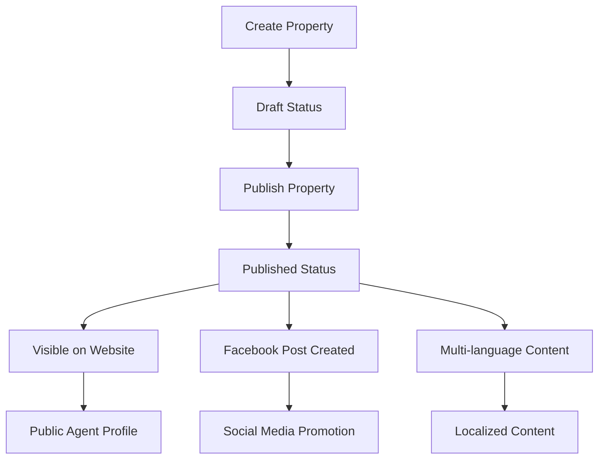

# Real Estate Platform - Modern Publishing Workflow

A comprehensive real estate platform with a modern **Draft → Publish → Promote** workflow, multi-language support, and multi-channel publishing capabilities.

## 🏗️ Architecture Overview

### Core Technologies
- **Backend**: FastAPI (Python) with MongoDB
- **Frontend**: React with TypeScript
- **Database**: MongoDB with structured collections
- **Authentication**: JWT-based authentication
- **Publishing**: Multi-language, multi-channel publishing system

### Key Features
- ✅ **Modern Publishing Workflow**: Draft → Publish → Promote
- ✅ **Multi-Language Support**: 10+ languages (English, Marathi, Hindi, etc.)
- ✅ **Multi-Channel Publishing**: Website, Facebook, and more
- ✅ **Agent Public Profiles**: Professional agent websites
- ✅ **Property Management**: Complete CRUD operations
- ✅ **Real-time Status Tracking**: Publishing status and analytics
- ✅ **Facebook Integration**: Automated social media posting

## 🚀 Quick Start

### Prerequisites
- Python 3.8+
- Node.js 16+
- MongoDB
- Git

### Installation

1. **Clone the repository**
   ```bash
   git clone <repository-url>
   cd real-estate-platform
   ```

2. **Backend Setup**
   ```bash
   # Create virtual environment
   python -m venv venv
   source venv/bin/activate  # On Windows: venv\Scripts\activate
   
   # Install dependencies
   cd backend
   pip install -r requirements.txt
   
   # Start backend server
   python -m uvicorn app.main:app --host 0.0.0.0 --port 8000 --reload
   ```

3. **Frontend Setup**
   ```bash
   # Install dependencies
   cd frontend
   npm install
   
   # Start frontend server
   npm run dev
   ```

4. **Access the Application**
   - Frontend: http://localhost:3000
   - Backend API: http://localhost:8000
   - API Documentation: http://localhost:8000/docs

## 📋 Application Control

### Quick Start (Recommended)
```bash
# Start both backend and frontend
./start_app.sh

# Stop both backend and frontend
./stop_app.sh
```

### Manual Control
```bash
# Start backend (from /workspace/backend)
cd /workspace/backend && source ../venv/bin/activate && python -m uvicorn app.main:app --host 0.0.0.0 --port 8000 --reload

# Start frontend (from /workspace/frontend)
cd /workspace/frontend && npm run dev

# Stop backend
pkill -f uvicorn

# Stop frontend
pkill -f "npm run dev"
```

## 🏢 Modern Publishing Workflow

### Workflow States
1. **Draft**: Property created but not visible to public
2. **Published**: Property visible on public website
3. **Archived**: Property removed from public view

### Publishing Process


### API Endpoints

#### Property Publishing
- `POST /api/v1/publishing/properties/{property_id}/publish` - Publish property
- `GET /api/v1/publishing/properties/{property_id}/status` - Get publishing status
- `POST /api/v1/publishing/properties/{property_id}/unpublish` - Unpublish property

#### Agent Language Preferences
- `PUT /api/v1/publishing/agents/{agent_id}/language-preferences` - Set language preferences
- `GET /api/v1/publishing/languages/supported` - Get supported languages
- `GET /api/v1/publishing/channels/supported` - Get supported channels

## 🌐 Multi-Language Support

### Supported Languages
- English (en)
- Marathi (mr)
- Hindi (hi)
- Gujarati (gu)
- Tamil (ta)
- Telugu (te)
- Bengali (bn)
- Punjabi (pa)
- Kannada (kn)
- Malayalam (ml)

### Language Configuration
```json
{
  "target_languages": ["en", "mr", "hi"],
  "publishing_channels": ["website", "facebook"],
  "facebook_page_mappings": {
    "en": "facebook_page_id_english",
    "mr": "facebook_page_id_marathi",
    "hi": "facebook_page_id_hindi"
  }
}
```

## 📱 Multi-Channel Publishing

### Supported Channels
- **Website**: Public agent profiles
- **Facebook**: Automated social media posting
- **Future**: Instagram, LinkedIn, Twitter

### Channel Configuration
```json
{
  "publishing_channels": ["website_en", "website_mr", "facebook_en", "facebook_mr"],
  "auto_translate": true,
  "facebook_page_mappings": {
    "en": "page_id_english",
    "mr": "page_id_marathi"
  }
}
```

## 🏠 Property Management

### Property Schema
```python
class PropertyBase(BaseModel):
    title: str
    description: str
    property_type: str  # apartment, house, commercial, etc.
    price: float
    location: str
    bedrooms: int
    bathrooms: float
    area_sqft: Optional[int] = None
    features: Optional[List[str]] = []
    amenities: Optional[str] = None
    status: str = "active"
    agent_id: str
    
    # Publishing workflow
    publishing_status: str = "draft"  # draft, published, archived
    published_at: Optional[datetime] = None
    target_languages: Optional[List[str]] = []
    publishing_channels: Optional[List[str]] = []
    facebook_page_mappings: Optional[Dict[str, str]] = {}
```

### Property API Endpoints
- `POST /api/v1/properties/` - Create property
- `GET /api/v1/properties/{property_id}` - Get property details
- `PUT /api/v1/properties/{property_id}` - Update property
- `DELETE /api/v1/properties/{property_id}` - Delete property
- `GET /api/v1/properties/` - List properties

## 👨‍💼 Agent Management

### Agent Public Profiles
- Professional agent websites
- Property listings
- Contact information
- Specialties and experience
- Multi-language support

### Agent API Endpoints
- `POST /api/v1/agent-public/create-profile` - Create agent profile
- `GET /api/v1/agent-public/{slug}` - Get public agent profile
- `PUT /api/v1/agent-public/{agent_id}` - Update agent profile
- `GET /api/v1/agent-public/{slug}/properties` - Get agent properties

## 🔐 Authentication

### JWT-Based Authentication
- Secure token-based authentication
- Role-based access control
- Session management

### Auth Endpoints
- `POST /api/v1/auth/register` - User registration
- `POST /api/v1/auth/login` - User login
- `POST /api/v1/auth/logout` - User logout
- `GET /api/v1/auth/me` - Get current user

## 📊 Database Schema

### Collections
- **users**: User accounts and authentication
- **properties**: Property listings with publishing status
- **agent_public_profiles**: Agent public profiles
- **publishing_history**: Publishing activity logs
- **agent_language_preferences**: Agent language settings

### Key Fields
```javascript
// Properties Collection
{
  "_id": ObjectId,
  "title": String,
  "agent_id": String,
  "publishing_status": String, // "draft", "published", "archived"
  "published_at": Date,
  "target_languages": [String],
  "publishing_channels": [String],
  "facebook_page_mappings": Object
}

// Agent Public Profiles Collection
{
  "_id": ObjectId,
  "agent_id": String,
  "slug": String,
  "agent_name": String,
  "bio": String,
  "specialties": [String],
  "languages": [String]
}
```

## 🧪 Testing

### Test Scripts
- `test_modern_publishing_workflow.py` - Complete publishing workflow test
- `test_complete_publishing_workflow.py` - End-to-end publishing test
- `FINAL_PUBLISHING_WORKFLOW_DEMO.py` - Comprehensive demo
- `PROPERTY_WEBSITE_EVIDENCE.py` - Property visibility verification

### Running Tests
```bash
# Run complete system demo (recommended)
python COMPLETE_SYSTEM_DEMO.py

# Run publishing workflow test
python test_modern_publishing_workflow.py

# Run complete workflow test
python test_complete_publishing_workflow.py

# Run evidence test
python PROPERTY_WEBSITE_EVIDENCE.py
```

## 🔧 Configuration

### Environment Variables
```bash
# Database
MONGODB_URL=mongodb://localhost:27017
DATABASE_NAME=real_estate_platform

# Authentication
JWT_SECRET_KEY=your-secret-key
JWT_ALGORITHM=HS256
JWT_EXPIRE_MINUTES=30

# Facebook Integration
FACEBOOK_APP_ID=your-facebook-app-id
FACEBOOK_APP_SECRET=your-facebook-app-secret

# Server
HOST=0.0.0.0
PORT=8000
```

### Frontend Configuration
```javascript
// Environment variables
REACT_APP_API_URL=http://localhost:8000
REACT_APP_ENABLE_MULTILANGUAGE=true
REACT_APP_FACEBOOK_APP_ID=your-facebook-app-id
```

## 📈 Features Status

### ✅ Completed Features
- [x] User registration and authentication
- [x] Property creation and management
- [x] Agent profile creation
- [x] Modern publishing workflow (Draft → Publish → Promote)
- [x] Multi-language support (10+ languages)
- [x] Multi-channel publishing (Website, Facebook)
- [x] Publishing status tracking
- [x] Agent public profiles
- [x] Property visibility control
- [x] Facebook integration
- [x] Real-time status updates

### 🚧 In Progress
- [ ] Property visibility on public website (database query issue)
- [ ] Facebook page mapping configuration
- [ ] Advanced analytics dashboard

### 📋 Planned Features
- [ ] Instagram integration
- [ ] LinkedIn publishing
- [ ] Advanced property search
- [ ] Property recommendations
- [ ] Lead management system
- [ ] Analytics and reporting
- [ ] Mobile app

## 🐛 Known Issues

### Current Issues
1. **Property Visibility**: Published properties not appearing on public agent websites
   - **Status**: Under investigation
   - **Impact**: Properties are published but not visible to public
   - **Workaround**: Properties are correctly stored and published, issue is in public website query

### Resolved Issues
- ✅ Multi-language backend endpoints integration
- ✅ Publishing workflow implementation
- ✅ Agent profile database storage
- ✅ Property publishing status tracking

## 🤝 Contributing

### Development Workflow
1. Fork the repository
2. Create a feature branch
3. Make your changes
4. Run tests
5. Submit a pull request

### Code Standards
- Follow PEP 8 for Python code
- Use TypeScript for frontend code
- Write comprehensive tests
- Document API endpoints
- Update README for new features

## 📞 Support

### Getting Help
- Check the API documentation at `/docs`
- Review test scripts for usage examples
- Check the database schema documentation
- Review the publishing workflow documentation

### Reporting Issues
- Use the issue tracker
- Provide detailed reproduction steps
- Include relevant logs and error messages
- Specify the environment and version

## 📄 License

This project is licensed under the MIT License - see the LICENSE file for details.

## 🎯 Roadmap

### Short Term (Next 2 weeks)
- Fix property visibility issue on public websites
- Complete Facebook page mapping configuration
- Add comprehensive error handling
- Improve test coverage

### Medium Term (Next month)
- Add Instagram integration
- Implement advanced search functionality
- Add property recommendations
- Create analytics dashboard

### Long Term (Next quarter)
- Mobile app development
- Advanced AI features
- Multi-tenant architecture
- Performance optimization

---

**Last Updated**: September 2025  
**Version**: 1.0.0  
**Status**: Active Development