# Avasetu agent guide

**Show Avasetu to a Pune agent, sign him up, get his first listing and first lead, and check in after a week.**

Written for you, the owner, to follow on your phone. Every step marked ✅ was run on the live site
(https://34-180-39-243.sslip.io) on 2 October 2026 with test numbers. The screenshots come from that run, and all the test data was
deleted afterwards. Steps marked ⚠️ were **not** run. Read them as instructions only, not as tested.

Our site address is `https://34-180-39-243.sslip.io`. Below it is shortened to **the site** (for example, "the site/for-agents").

---

## One-page checklist

**Before the meeting**
- [ ] Phone charged and on mobile data. Open the site/for-agents once so it loads fast later.
- [ ] Know his WhatsApp number and his main areas.

**Showcase (5 minutes, Part A)**
- [ ] the site/for-agents → the site/agent/demo → a listing on it and its chat → the site/agent/avasetu → the site/go → the site/news
- [ ] Ask: "Shall I make your page now? It takes 10 minutes."

**Onboard (Part B). Pick one way**
- [ ] **You do it for him:** Studio → Agents → + Add agent → send him the WhatsApp message → Brand → Add listing for him → he agrees on WhatsApp → switch Consent on → Preview his page → Post to Avasetu
- [ ] **He does it himself:** run `invite.ps1` for his number → send him the code → he opens the site/join → creates his site → My brand → + Add listing
- [ ] Collect: logo, banner, his photo, colour, business name, MahaRERA agent number, areas, languages, 3 to 6 photos per home, home details, about-the-project facts, consent on WhatsApp

**First listing and first lead (Part C)**
- [ ] Listing published, marketing pack opened, page shared on WhatsApp
- [ ] He knows where leads appear: Home badge, **Leads** tab, **Interest** tab

**Day 7 check-in (Part D)**
- [ ] 10-minute call and the tracking-sheet row filled in
- [ ] **Success = he adds a second listing within 7 days, without being asked.**

---

## Part A. Showcase in 5 minutes ✅

Hand him your phone, or share your screen on a WhatsApp video call. Open these links in this order. All of them loaded with no errors
in the test run (each in under 4 seconds).

| # | Open | What to say |
|---|---|---|
| 1 | the site/**for-agents** | "Avasetu is free for Pune agents during the pilot. You add a home from your phone. You get your own page, ready-made posts, and every buyer who shows interest becomes a lead card." |
| 2 | the site/**agent/demo** | "This is what **your** page looks like: your name, logo and colours, and only your homes. It is a demo, so the homes are marked Sample." |
| 3 | Tap a home on the demo page, then **Chat with us** | "Buyers ask questions here at any hour. The chat answers from your listing. With the buyer's permission, it takes his number and sends you a lead with his budget, BHK and area." |
| 4 | the site/**agent/avasetu** | "This is our own page. When you agree, your homes also go on the Avasetu Facebook Page and Instagram with **your** name and RERA number, and buyers reach you." |
| 5 | the site/**go** | "This is the link from our Instagram bio. It lists the latest homes and posts." |
| 6 | the site/**news** | "Local property news in plain words, which you can share with buyers." |
| 7 | Instagram: **instagram.com/avasetu_** (linked from the for-agents page) | "Our Instagram, where your homes will appear." |
| 8 | the site/**request-invite** | Only if he wants to sign up later on his own. Do not fill it in for him if you will onboard him now. |

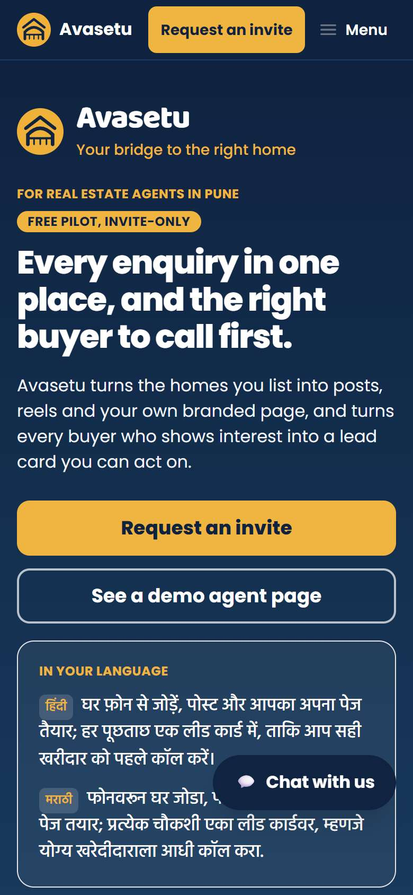 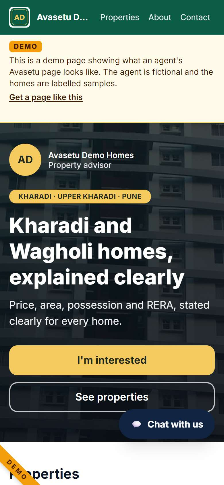 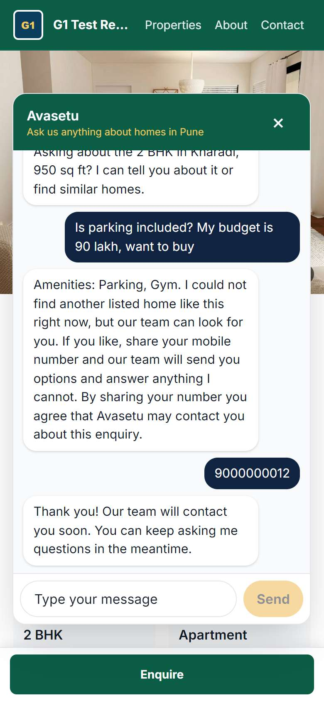

**Short lines that work**
- हिंदी: "आपका अपना पेज, आपके नाम और लोगो के साथ। प्रॉपर्टी फ़ोन से डालिए, पोस्ट तैयार मिलेंगी, और हर खरीदार एक लीड कार्ड बनकर आपके पास आएगा। पायलट में बिल्कुल मुफ़्त।"
- मराठी: "तुमचं स्वतःचं पेज, तुमच्या नावाने आणि लोगोसह. प्रॉपर्टी फोनवरून टाका, पोस्ट तयार मिळतील, आणि प्रत्येक खरेदीदार लीड कार्ड म्हणून तुमच्याकडे येईल. पायलटमध्ये पूर्ण मोफत."

**What you can promise (true today):** a free page in minutes; posts and cards in English, Hindi and Marathi; posting to the Avasetu
Facebook Page and Instagram with his name, after his consent; a website chat that hands over leads with the buyer's consent; a
weekly summary. **Do not promise:** posting from **his own** Facebook or Instagram, guaranteed leads, price predictions, or a call button
on his page.

---

## Part B. Onboard an agent

### What to collect from him (send this as one WhatsApp message)

> Namaste {name} ji, to set up your Avasetu page please send:
> 1. Your **logo** (square) and a **banner** photo (wide: your office or a skyline is fine)
> 2. A clear **photo of yourself**
> 3. Your **business name** and a **colour** you like (or your logo's colour)
> 4. One line about you (**tagline**) and 2 to 3 lines **about you** (years, areas, what you are known for). No phone numbers or links in these.
> 5. Your **MahaRERA agent registration number** (it starts with A)
> 6. The **areas** you work in (up to 6 in Pune) and the **languages** you speak
> 7. For each home: locality and project name, BHK, carpet area, price, possession, floor, furnishing, amenities, **3 to 6 real photos**,
>    and what buyers always ask (parking, maintenance, water, power backup, nearby schools and offices)
> 8. Please reply **"I agree"** to this: *I agree that Avasetu may feature me and my listings on the Avasetu Facebook Page, Instagram and website, with my name and RERA number, and that buyers' interest comes to my inbox.*

Rules the app enforces (you will see an error if you break them): text fields reject phone numbers, links and e-mail addresses. The
business name can be up to 60 characters and the tagline up to 90. Areas must be in Pune. The RERA number is "A" followed by digits.
We show it as "stated by the agent" and never call him "verified".

### Way 1. You set him up (Studio → Agents) ✅

This needs an owner account (yours). The **Agents** tab appears in Studio only for owner accounts. The test used a temporary owner
account, which has been deleted.

1. **Studio → Agents → + Add agent.** Fill in his name, his 10-digit mobile number, and a label for yourself (for example "Rahul, Baner").
   Tap **Create agent**. *(4 s)*
   <br>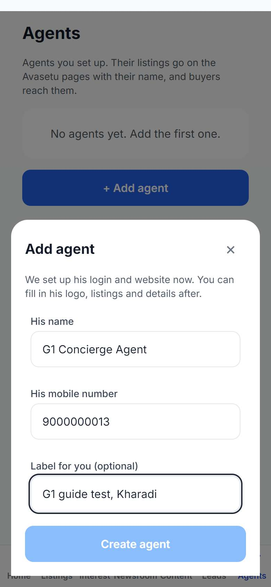 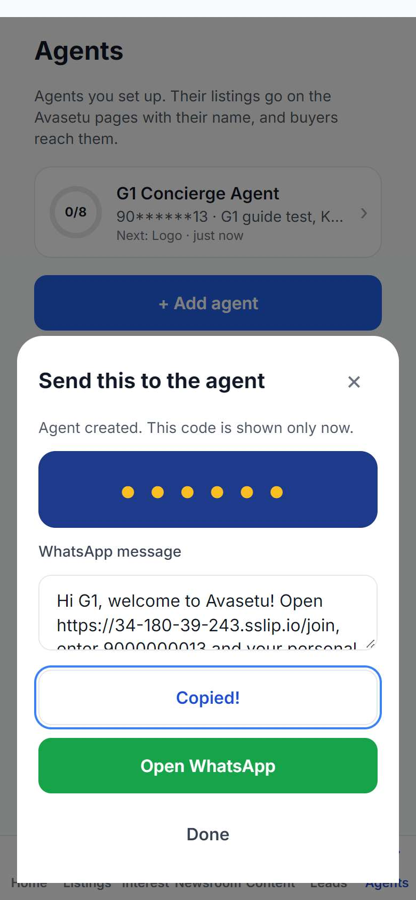
2. The sheet shows his **6-digit code** (shown **only now**) and a ready message:
   *"Hi Rahul, welcome to Avasetu! Open https://34-180-39-243.sslip.io/join, enter 98XXXXXXXX and your personal code XXXXXX. Please don't share it."*
   Tap **Copy message**, then **Open WhatsApp** (or paste the message into his chat). Then tap **Done**.
   ⚠️ The test did not open WhatsApp. Sending the message by hand works the same way.
3. Tap his row. You see his **Setup checklist** (logo, banner, RERA number, areas, photo, first listing, 3 listings, consent) and the ring (0/8).
   <br>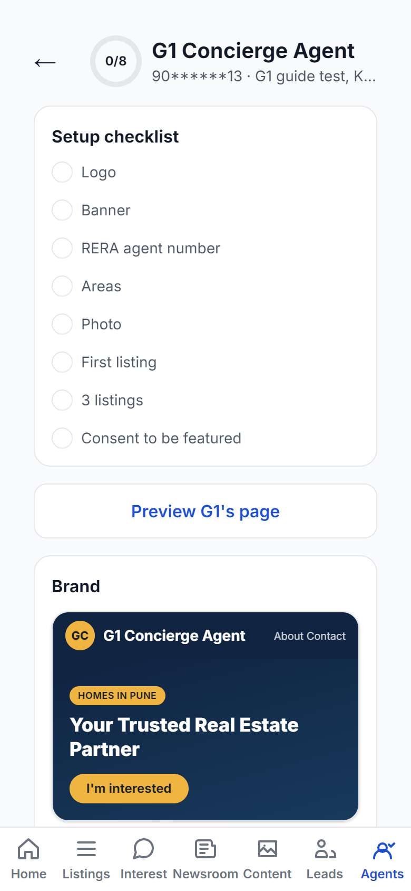
4. **Brand:** fill in the business name and tagline, tap his areas, upload his logo, type his RERA number, then tap **Save my brand**. ✅ (logo, name,
   tagline, areas and RERA were tested. ⚠️ Banner and his photo were not uploaded in the test, but they use the same picker.)
   <br>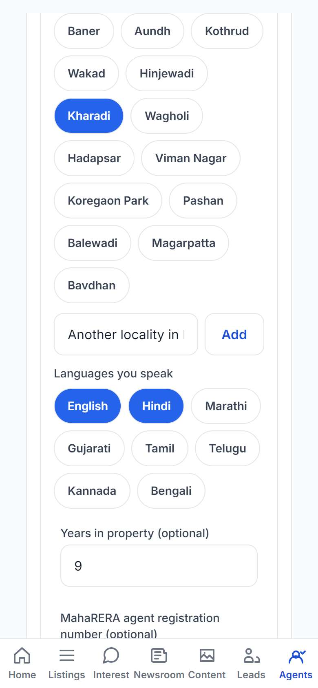
5. **Add listing for {him}:** the same three steps as in Part C (type it, About the project, check and confirm). You see "Saved for {him}". *(9 s)*
   <br>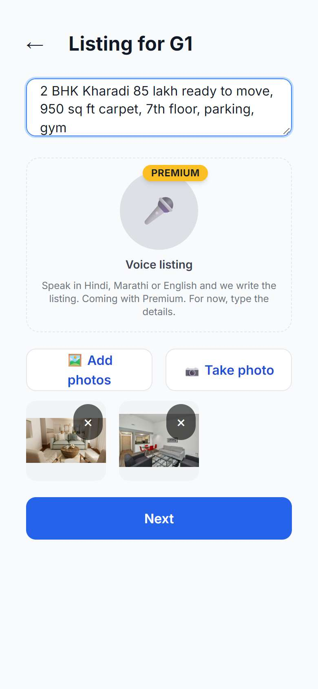 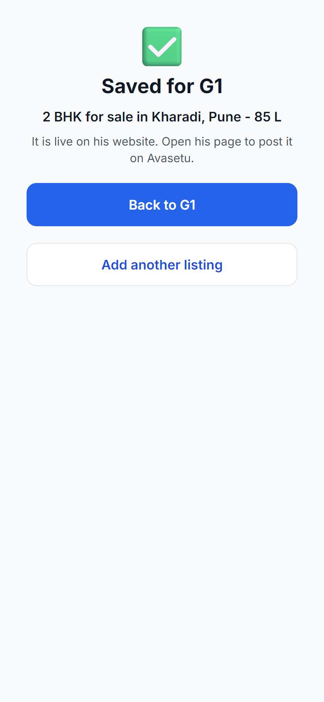
6. **Consent:** only after he has replied "I agree" on WhatsApp, switch **"{He} has agreed"** on. Until then, Avasetu will not post his homes.
   <br>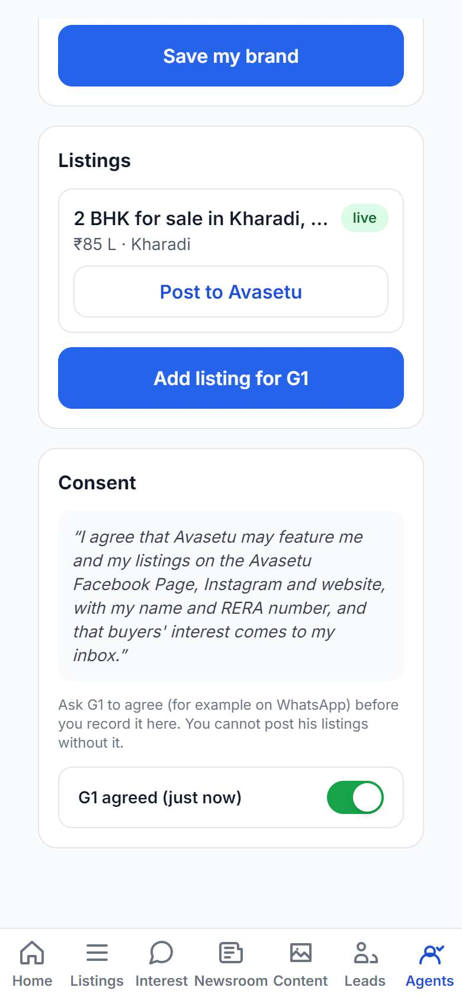
7. **Preview {his} page:** read it as a buyer would.
   <br>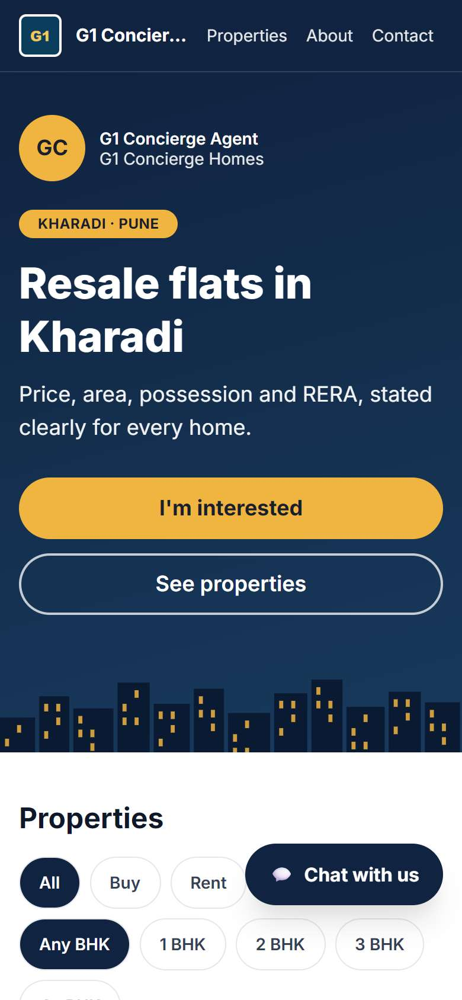
8. **Post to Avasetu** (on the listing): the screen first shows the **exact** Facebook and Instagram text. Check for "Listed by {his business}
   on Avasetu | RERA agent reg: {number}" and his interest link. There is no phone number. Then tap **Approve and post for {him}**.
   ✅ Tested up to the caption preview. ⚠️ **Approve and post was not tapped** (nothing was posted to Facebook or Instagram in the test).
   <br>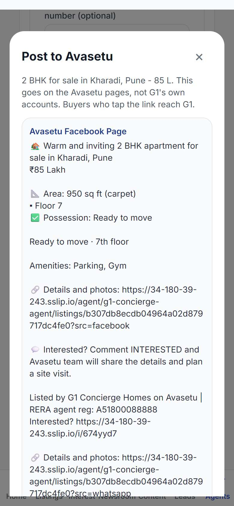

Tell him plainly: "Your homes appear on our pages with your name. Buyers reach you through your link and your Interest tab. We do not
post from your own Facebook or Instagram yet."

### Way 2. He signs up himself with a code ✅

1. On your laptop, from the repo folder:
   ```
   .\deploy\gcp\invite.ps1 -Phone 98XXXXXXXX -Label "Rahul, Baner"
   ```
   It prints his code and a ready message that includes the sign-in link. Send it to him on WhatsApp. (⚠️ The test ran the server script that `invite.ps1` calls, `scripts/invite.py issue`, directly. It did not run `invite.ps1` from the laptop.)
2. He opens **the site/join**, waits a second for the page to load, enters his mobile number and taps **Send OTP**. No SMS comes: the next
   screen asks for **"your 6-digit invite code"**. He types the code from your message, and it signs him in by itself. *(about 5 s)*
   <br>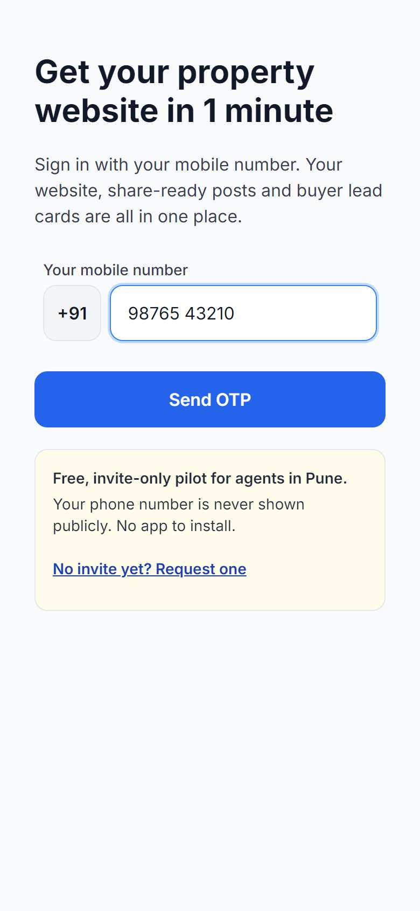 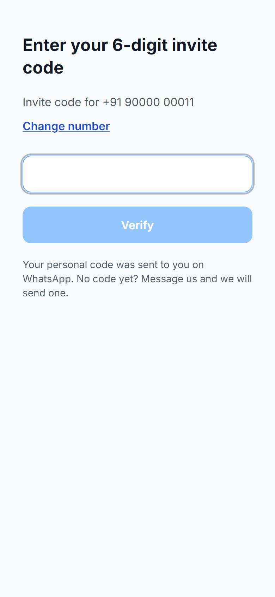
3. **Tell us about you:** name, city **Pune**, business name, a colour theme, languages, then **Create my website**. *(1 to 2 s)*
   <br>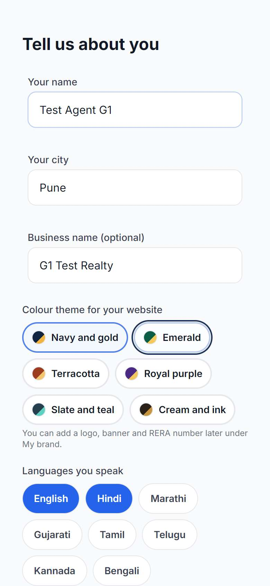 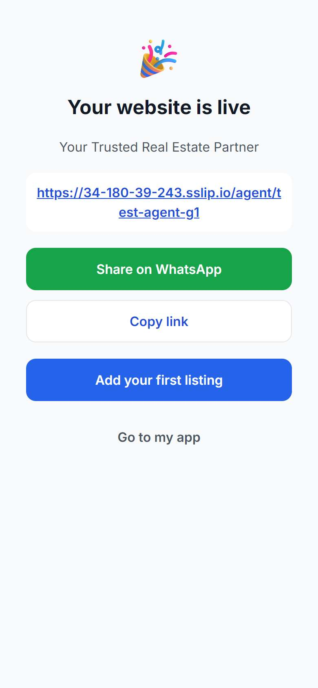
4. "Your website is live" shows his link. Tap **Go to my app** to reach **Studio** (or **Add your first listing** to start right away).
5. On Studio Home, he taps **My brand** to add his tagline, areas, logo, banner, photo, languages and RERA number, then **Save my brand**.
   He sees "Saved. Your site now shows this look." *(2 s)*
   <br>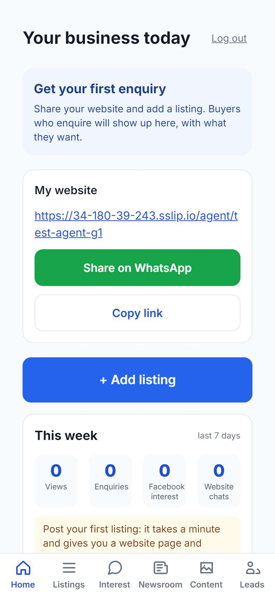 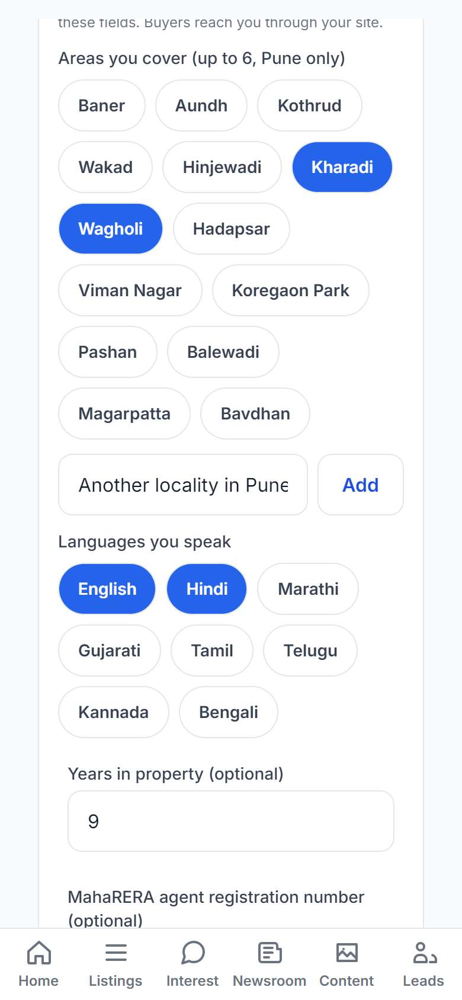 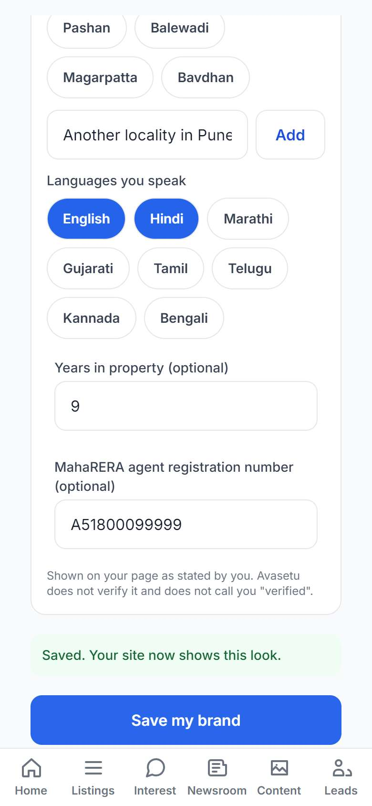

   Note: "Years in property" shows a grey **9** as an example. That field is empty until he types in it.

---

## Part C. His first listing and first leads ✅

### Add the listing (about 1 minute)
1. Studio → **+ Add listing**. He types it the way he would say it, for example:
   *"2 BHK Kharadi 85 lakh ready to move, 950 sq ft carpet, 7th floor, parking, gym"*
   Then he taps **Add photos** and picks 2 to 6 photos, and taps **Next**. The AI read this in about 8 seconds.
   <br>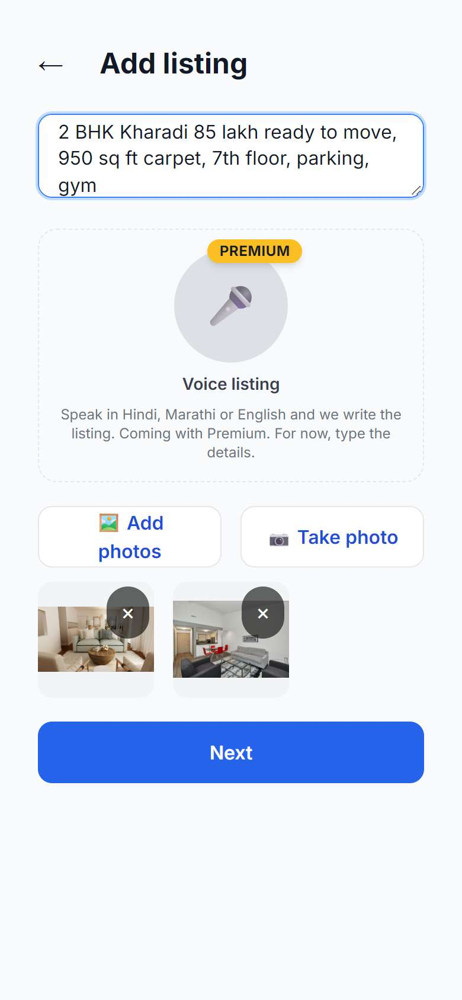
2. **About the project and area** (optional, but it helps the chat answer buyers): tap **Suggest from my description and the area guide**,
   check the suggestions (green "Area guide" means the line came from our guide, blue "You said" means it came from his words),
   tap **Keep all** or **Remove** on any line that is not true, then tap **Continue**. In the test it kept 11 lines (WTC Pune, EON, metro
   "approved, not running yet", parking and so on).
   <br>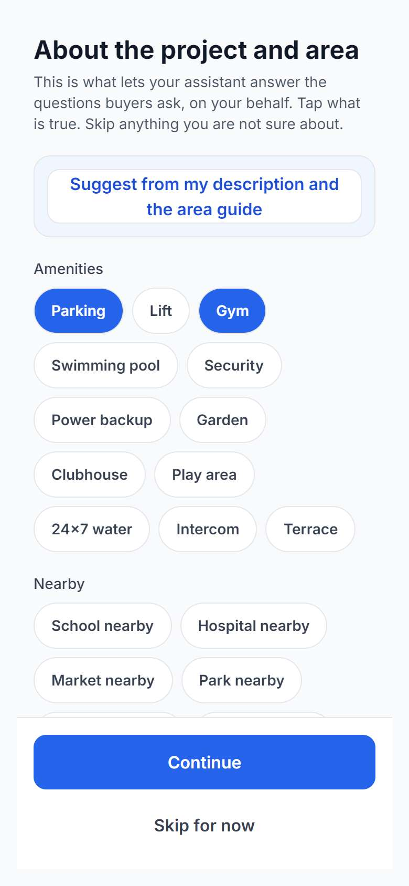 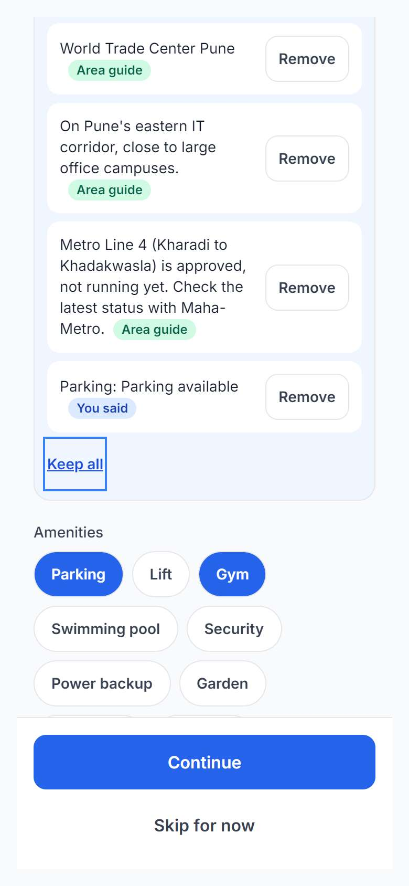
3. **Check and confirm:** the draft had Kharadi, 2 BHK, 950 sq ft, floor 7, ₹85 L and Ready. Fix anything that is wrong. If the price looks
   unusual, tick "Yes, this price is correct". Then tap **Confirm & post**. You see "Your property is ready". *(4 s)*
   <br>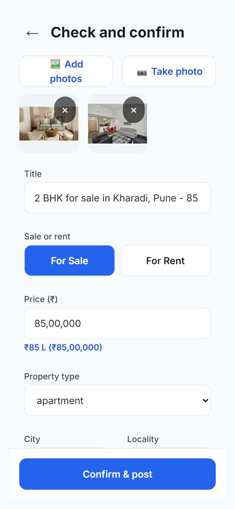 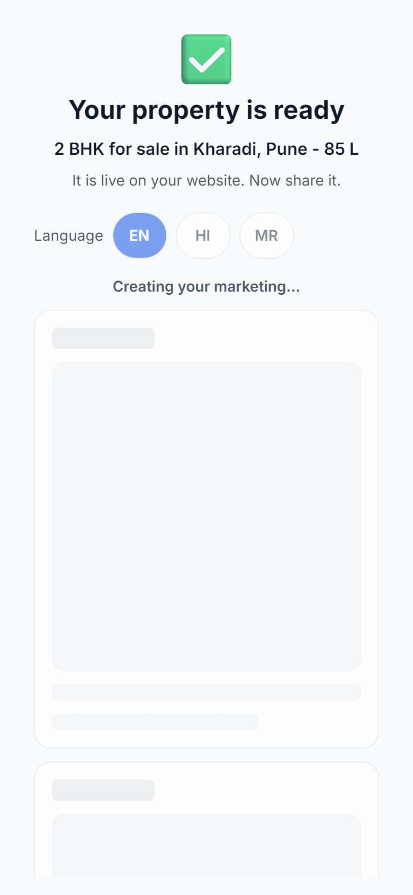

### Share it (the marketing pack)
4. Listings → the listing → **Marketing** (it also appears under "Your property is ready"). It has ready cards and captions in
   **EN / HI / MR**, with "Listed by {business} · RERA {no}" on the card. He shares them to WhatsApp Status, groups, Instagram or
   Facebook. *(The first time it takes about 10 s to make the cards.)*
   <br>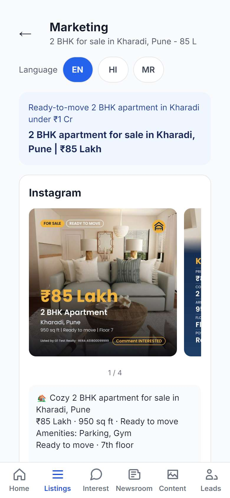
   ⚠️ Only the English tab was opened in the test.
5. His page: the site/agent/{his-name} and the listing page.
   <br>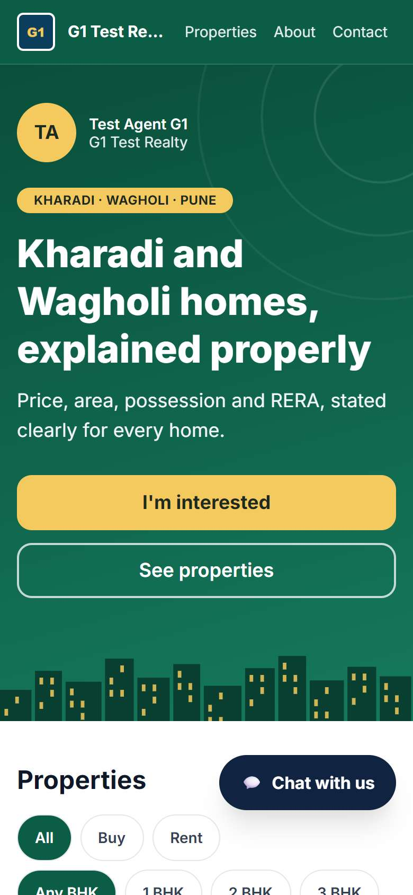 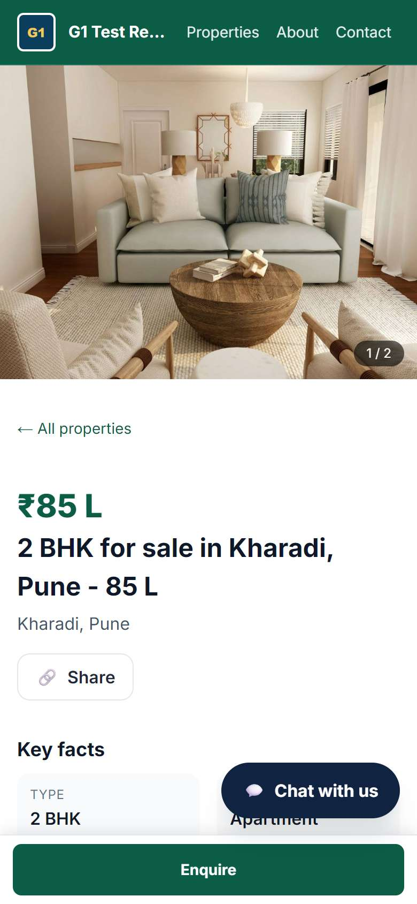

### Where the first leads show up
6. A buyer on his listing page tapped **Chat with us** and asked *"Is parking included? My budget is 90 lakh, want to buy"*. The chat
   answered (Parking, Gym), said there is no other similar home yet, and asked for the buyer's number, with the consent sentence next to it. The buyer
   typed his number and got "Thank you! Our team will contact you soon." *(9 s)*
   <br>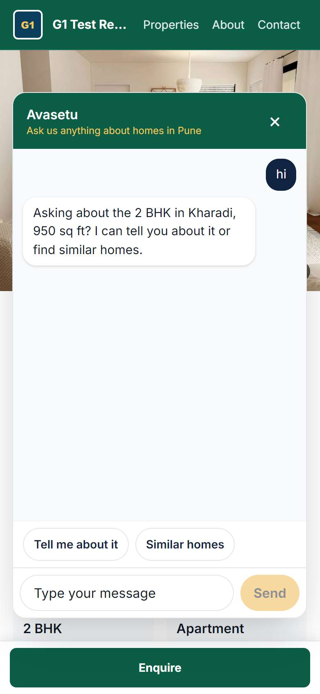 
7. In his Studio, all of these showed up straight away:
   - **Home:** a green badge "**1** New lead or chat from your website", and "1 New enquiries".
   - **Leads:** "Website visitor · 2 BHK · under 90L · Kharadi" with the buyer's number and the chat summary. Tap it to call or WhatsApp.
   - **Interest → Website chats:** the conversation, marked "lead saved".
   - **The lead itself:** an AI summary ("Wants a 2 BHK under 90L in Kharadi"), **Call** and **WhatsApp** buttons, and his matching homes.
   <br>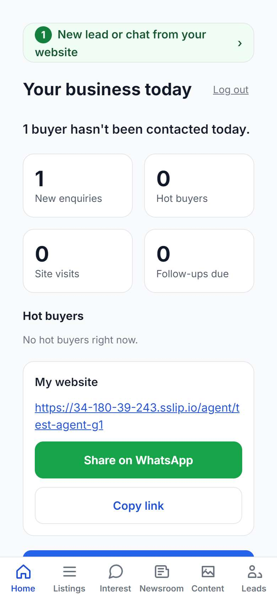 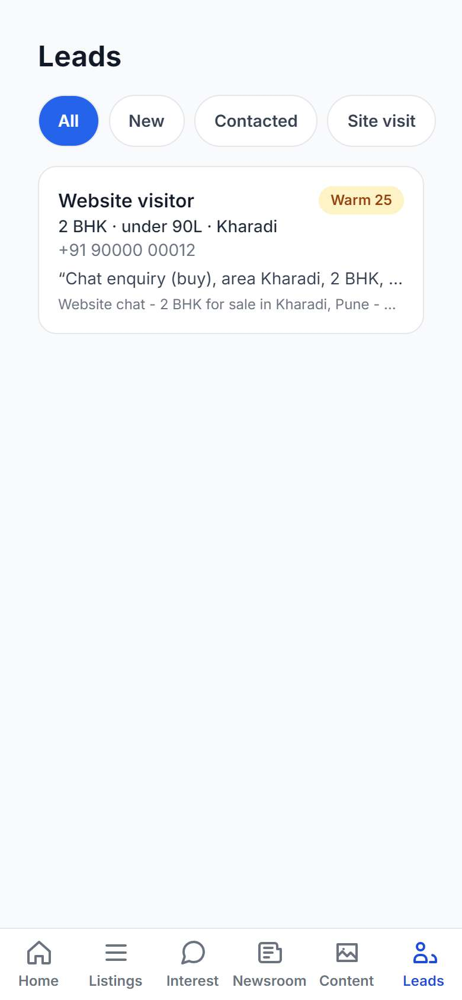 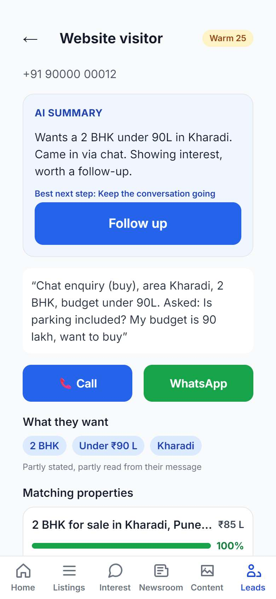 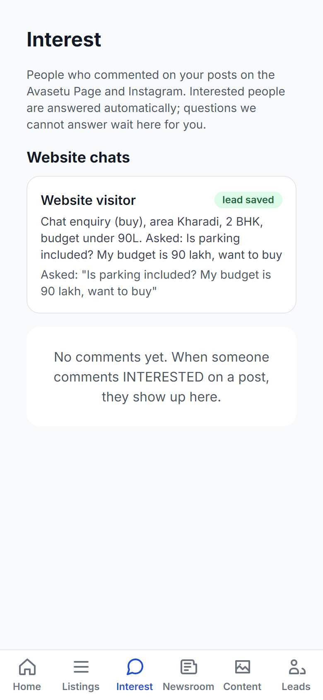

Tell him: "Check **Home** every morning. The green badge means someone wants you. Call the buyer the same day."

---

## Part D. First-week check-in (day 7, 10 minutes)

Ask these questions and write down the answers:
1. Did you post a listing? How long did it take? What confused you?
2. Did you share the cards? Where (WhatsApp Status, groups, Instagram, Facebook)?
3. Did anyone enquire? How (chat, form, comment, WhatsApp)? Was the summary useful?
4. What would make you post your **next** home here, and not only on WhatsApp?
5. If this saved you an hour a day, what would you pay per month?

**Success measure:** he adds a **second listing within 7 days** of the first, **without being asked**.
Check it in Studio → Agents (the ring and "3 listings" item) or on his page.

**Tracking sheet (one row per agent):** Agent | Area | Invited on | First listing on | Listings after 14 days | Photos on listings |
Enquiries | Site visits | Second listing within 7 days (Y/N) | Main complaint | Would pay (₹/month)

---

## Part E. Troubleshooting

| Problem | What to do |
|---|---|
| **"Incorrect code"** ✅ | He typed the code wrong. He should clear the box and type the 6 digits again. (Before 2 October the app showed "Request failed (400)" here instead. That is fixed.) <br>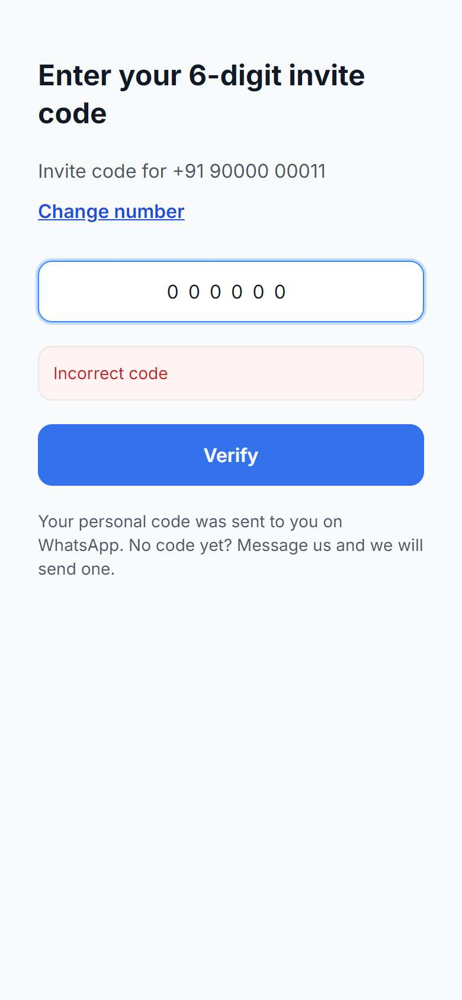 |
| **"Too many wrong attempts"** or **"This invite is locked"** ⚠️ | After 5 wrong codes the number is locked for 30 minutes. After 15 it is locked until you send a new code. Give him a new code with `.\deploy\gcp\invite.ps1 -Phone 98XXXXXXXX`, or use **Make a new code** in Studio → Agents. The old code stops working. (Not tested: only one wrong code was tried.) |
| **"Signup is by invitation"** ✅ | That number has no invite. Check that you typed his number correctly in the invite, and issue one. |
| **The page jumps back after "Send OTP"** ✅ | The page had not finished loading. Wait a second and tap again. |
| **His page does not show a change** ✅ | Pages refresh about 30 seconds after a change, and the **first** visit after a change can still show the old page. Wait a minute, then reload. In the test, a new logo and listing appeared on a later visit. The listing page and Studio update at once. |
| **Photo upload fails** ⚠️ | Use JPG or PNG photos taken with the phone camera, and add a few at a time. The app makes them smaller before upload. On weak mobile data, try again on Wi-Fi. If one keeps failing, take a screenshot of the error and send it to the developer. (Uploads worked in the test: a logo and 2 photos for each listing.) |
| **"Request failed (409)" on Post to Avasetu** ✅ | Fixed on 2 October: the app now makes the missing marketing pack itself. If you see "Record the agent's consent", switch Consent on first. |
| **No leads** | Check that the listing is **live** (Listings tab). Share the **listing page** link, not only the photos. Open the chat on his listing yourself to check that it answers. Leads only come when the buyer gives his number. Questions without a number appear under **Interest → Website chats**. |
| **His post is not on Facebook or Instagram** ⚠️ | Posting goes only to the **Avasetu** Page and Instagram, never his own accounts. It needs his consent switched on and your **Approve and post**. While real posting is switched off on the server (`SOCIAL_DRY_RUN=true`), nothing actually appears and the result says "dry run". Instagram posts show "link in our bio": check the site/go. If Facebook shows a red banner in Interest, the Page token has expired: see docs/META_SETUP.md. (Not tested: nothing was posted in this run.) |
| **Site down** ✅ | the site/api/v1/health should say "healthy". If not, see docs/PILOT_RUNBOOK.md. |

---

### For the developer: how this guide was tested
- Script: `frontend/e2e/guide-run.js` (system Chrome, 390x844). Commands: `PHASE=self|owner|show CODE=<test code> node e2e/guide-run.js`.
- Test data helper: `backend/scripts/g1_testdata.py scan | promote <test no> | delete --confirm`. It only touches 9000000011 to 9000000014 and the G1 test names.
- Bugs found and fixed during the run: app error messages showed "Request failed (NNN)" (server error envelope not unwrapped), which
  broke Post to Avasetu on first use; the chat on a listing page said "could not find a listed home that matches" when the page's own home
  matched; the Studio badge read "New website chat lead or chat"; the server invite script printed "<your app link>" instead of the join link.
