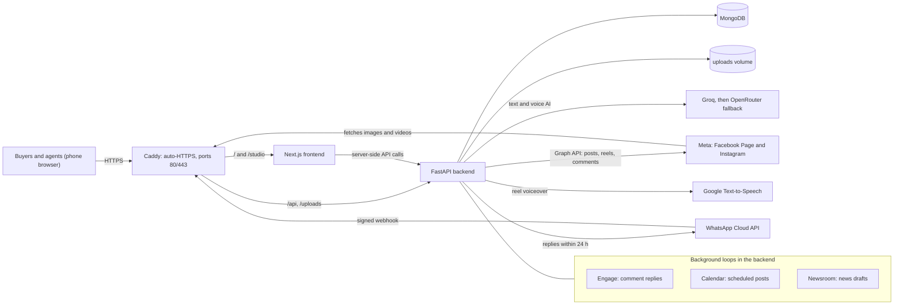

# Avasetu operator guide

**Set up, deploy and run the Avasetu platform: architecture, a fresh install, every setting, the connect scripts, deploys, daily
operations, a domain switch, security and common fixes.**

This guide is for operators: the technical people who host Avasetu. Partners and agents have their own guides and never need anything
here. It contains **no secrets**. Every secret lives only in the server's private `deploy/gcp/.env`, and every connect script asks for
secrets with hidden input and never prints them.

Placeholders: `<PROJECT>` (GCP project id), `<ZONE>` (for example `asia-south1-a`), `<VM>` (instance name), `<DOMAIN>` (the public
host name, without `https://`), `<IP>` (the VM's external address). Commands for your PC are PowerShell, run from the repo root.
Commands for the VM are bash, run in `~/app/deploy/gcp` unless noted.

Marks: ✅ in use on the pilot server today. ⚠️ not run as written (derived from the code and the pilot setup); check as you go.

---

## 1. Architecture

One Google Cloud VM runs four Docker containers with Docker Compose (`deploy/gcp/docker-compose.yml`):

| Container | Image | Role |
|---|---|---|
| `caddy` | `caddy:2` | The only public service (ports 80 and 443). Automatic HTTPS for `SITE_HOST`. Sends `/api/*`, `/docs`, `/openapi.json` and `/uploads/*` to the backend and everything else to the frontend (`deploy/gcp/Caddyfile`). |
| `frontend` | built from `frontend/` | Next.js (App Router, standalone output, `next build --webpack`). Public site (agent pages, listings, chat, `/go`, `/news`, `/for-agents`, `/join`, legal pages) and **Studio** (`/studio`, the agents' and owners' phone app). Server-side calls go to `http://backend:8000` (`SITE_API_URL`). |
| `backend` | built from `backend/` | FastAPI (Python 3.11, uvicorn) on port 8000. All APIs under `/api/v1`, uploaded and generated media under `/uploads` (Docker volume `uploads`). Runs three background loops. |
| `mongo` | `mongo:7` | MongoDB, private to the compose network (no published port). Database `propertyai` by default. Volume `mongo_data`. |

Volumes: `mongo_data` (database), `uploads` (photos, cards, reels, the depth model), `caddy_data` and `caddy_config` (certificates).

### Component diagram



### Background loops (started in `backend/app/core/application.py`)
Each loop is idle unless its switch is on, and each checks the owner's pause switch (Admin → Controls, stored in the `admin_settings`
collection) at the start of every cycle.

| Loop | Module | Switch | Interval | Pause switch |
|---|---|---|---|---|
| Comment assistant: reads comments on the Page's and Instagram's recent posts, answers simple ones, queues questions for a person, ignores spam | `modules/engage` | `ENGAGE_ENABLED` | 60 s | Pause comment replies |
| Content calendar: publishes **approved** posts, carousels, sample-home showcases and reels when due (at most 1 per channel per pass, 3 attempts, skips anything more than 48 h late) | `modules/calendar` | `CALENDAR_ENABLED` | 300 s | Pause posting |
| Newsroom: collects property news (publishers, Google News, MahaRERA), drafts and checks posts for owner review, publishes approved items (cap 2 a day), builds a weekly digest on Sunday evening | `modules/newsroom` | `NEWSROOM_ENABLED` | 3 h | Pause news |

No post, carousel or reel goes to Facebook or Instagram without a person's approval (Studio → Content, Newsroom, or Post to Avasetu on
a listing), and no post leaves the server at all while `SOCIAL_DRY_RUN` is true. Comment replies are the one automatic action; they
have their own practice switch (`ENGAGE_DRY_RUN`) and hourly caps.

### The content pipeline
- **Creative** (`modules/creative`): strategist → copywriter → art director → critic. An LLM proposes, rules decide: every field is
  checked (length, hype, phone numbers, prices, predictions, personal names, URLs, any number not in the facts) and replaced by the
  rule-based draft when it fails. Eight card layouts, Instagram 1080x1350, Facebook 1080x1080. Text on cards is Latin script only.
- **Showcase** (`modules/showcase`): nine labelled **sample** homes (Kharadi, Upper Kharadi, Wagholi) rendered as carousels and cards.
  Captions are validated (sample label, disclaimer, no phone, no URL on Instagram) before any send.
- **Reels** (`modules/reels`): 1080x1920 H.264 + AAC, 12 to 17 s, ffmpeg from the `imageio-ffmpeg` wheel (no system package).
  The **AI director** (`director.py`) asks the LLM for 4 beats (short on-screen text plus a spoken line) from the supplied facts only;
  **Google Text-to-Speech** (Chirp 3 HD Indian voices, English, Hindi, Marathi) voices each beat; a **depth model** (Depth Anything V2
  small, ONNX on CPU) gives photos a 2.5D parallax. Without the TTS key or the depth model, reels still render (silent, plain zoom).
  A 16 s reel takes about a minute of CPU, so reels are pre-rendered in the background up to 2 hours before they are due.
- **Calendar** (`modules/calendar`) is the one place that ties these together (`calendar/adapters.py`), plans a weekly rhythm and
  publishes approved rows.
- **Listings** (`modules/ai_listing`, `listings`, `marketing`): the agent types or speaks a listing; the LLM extracts facts (with rule
  checks and a price sanity check); the marketing pack makes cards and captions in English, Hindi and Marathi.
- **Chat and knowledge** (`modules/chat`, `knowledge`): the website chat and the WhatsApp assistant share one engine. Answers come only
  from the listing's facts and a vetted knowledge base; samples are called samples; unknowns are handed to the agent.

### Integrations
| Service | Used for | Configured by |
|---|---|---|
| Meta Graph API (Facebook Page, Instagram Professional account linked to it) | Posts, carousels, reels, reading and answering comments | `meta_connect.ps1` |
| WhatsApp Cloud API | Buyer chats: free replies within 24 h of the buyer's last message, no paid templates | `whatsapp_connect.ps1` |
| Groq (OpenAI-compatible) | Primary text AI (listing extraction, translations, chat, director) and voice notes (Whisper) | `ai_connect.ps1` |
| OpenRouter (free models) | Text AI fallback when Groq fails | `ai_connect.ps1` |
| Google Gemini | Optional extra fallback and optional voice transcription (off on the pilot) | `.env` by hand |
| Google Cloud Text-to-Speech | Reel voiceover | `GOOGLE_TTS_API_KEY` in `.env` by hand |
| Hugging Face | One-time download of the depth model into the uploads volume | automatic on first reel |

---

## 2. Set up from scratch on a fresh GCP VM ⚠️

These steps rebuild what the pilot runs. They were written from the deploy scripts and the pilot's setup, not re-run end to end on a new
project. You need: the Google Cloud SDK (`gcloud`) on your PC, logged in; Git; this repo with your changes committed.

### 2.1 Create the VM, a fixed address and the firewall
```
gcloud config set project <PROJECT>
gcloud compute addresses create <VM>-ip --region <REGION>
gcloud compute instances create <VM> --zone <ZONE> --machine-type e2-medium --image-family debian-12 --image-project debian-cloud --boot-disk-size 30GB --address <VM>-ip --tags web
gcloud compute firewall-rules create allow-web --allow tcp:80,tcp:443 --target-tags web
```
`<REGION>` is the zone without its last letter part (for `asia-south1-a` it is `asia-south1`). Size: at least 4 GB of RAM (the frontend
build needs it; e2-medium has 4 GB) and 30 GB of disk (Docker images, the uploads volume and 14 nightly backups). Reels are CPU-bound, so
more vCPUs make them faster. Add a daily disk snapshot schedule in Compute Engine → Snapshots (the pilot keeps 7 days).

### 2.2 Point the domain
Create a DNS **A record** for `<DOMAIN>` pointing at the reserved `<IP>`. Without a domain, use the free `sslip.io` name
`<IP with dots replaced by dashes>.sslip.io` (the pilot does this). Caddy gets the HTTPS certificate by itself on first start, so ports 80
and 443 must be open and the name must already resolve.

### 2.3 Install Docker on the VM
```
gcloud compute ssh <VM> --zone <ZONE> --project <PROJECT>
curl -fsSL https://get.docker.com | sudo sh
sudo docker compose version
mkdir -p ~/app/deploy/gcp
```

### 2.4 Write the private `.env` on the VM
Create `~/app/deploy/gcp/.env` with an editor on the VM (never on your PC, never in git), then `chmod 600 .env`. Minimum to start:
```
SITE_HOST=<DOMAIN>
MONGO_PASSWORD=<random, for example the output of: openssl rand -hex 24>
JWT_SECRET_KEY=<random, for example the output of: openssl rand -hex 32>
JOIN_MODE=invite
PUBLIC_MEDIA_BASE_URL=https://<DOMAIN>
SOCIAL_DRY_RUN=true
```
`MONGO_PASSWORD` only takes effect the first time the `mongo_data` volume is created (see section 6.5 to change it later). Set
`JWT_SECRET_KEY` before the first agent signs in: changing it later signs everyone out. Section 3 lists every other setting.

### 2.5 First deploy (from your PC)
```
.\deploy\gcp\deploy.ps1 -Project <PROJECT> -Zone <ZONE> -Instance <VM> -HealthUrl https://<DOMAIN>/api/v1/health -DryRun
.\deploy\gcp\deploy.ps1 -Project <PROJECT> -Zone <ZONE> -Instance <VM> -HealthUrl https://<DOMAIN>/api/v1/health -ContactEmail <contact address>
```
The first build takes a long time (no Docker cache). `-ContactEmail` sets the address shown on `/privacy`, `/terms` and `/data-deletion`.

### 2.6 The first owner account
1. Issue an invite for the owner's mobile: `.\deploy\gcp\invite.ps1 -Phone <10-digit mobile> -Label "Owner" -Project <PROJECT> -Zone <ZONE> -Instance <VM>`.
2. The owner opens `https://<DOMAIN>/join`, enters the mobile number and the code, and creates his page ("Tell us about you").
3. Find his user id and his agent id on the VM (replace the number; the phone is stored as `+91` plus 10 digits):
   ```
   sudo docker compose exec -T mongo sh -c 'mongosh --quiet -u "$MONGO_INITDB_ROOT_USERNAME" -p "$MONGO_INITDB_ROOT_PASSWORD" --authenticationDatabase admin propertyai --eval "printjson(db.users.findOne({phone: \"+91XXXXXXXXXX\"}, {_id: 1}))"'
   ```
   The id is the hex string inside `ObjectId("...")`. His page's `agent_id` is in `agent_public_profiles` (`findOne({slug: "<his slug>"}, {agent_id: 1, slug: 1})`).
4. Add to `.env`: `CONCIERGE_OWNER_IDS=<user id>` (Admin and Agents tabs), `NEWSROOM_OWNER_IDS=<user id>` (approve news),
   `CALENDAR_OWNER_IDS=<user id>` (approve scheduled posts), `INTEREST_OWNER_AGENT_ID=<agent id>` (receives interest in samples,
   guides and Page-level posts) and `ENGAGE_OWNER_AGENT_ID=<agent id>`. Then `sudo docker compose up -d backend`.
5. The platform's own public page is the profile with slug `avasetu` (`INTEREST_OWNER_SLUG`). The pilot renamed the owner's page with
   `backend/scripts/make_official_page.py`; that script has the pilot owner's old slug written in, so adapt it before using it elsewhere.

**Partners** get the same treatment: add their user ids (comma separated) to `CONCIERGE_OWNER_IDS`, and to `NEWSROOM_OWNER_IDS` and
`CALENDAR_OWNER_IDS` if they approve content. Superusers (`is_superuser` on the user) are always owners; prefer the id lists, which are
visible and easy to undo.

### 2.7 Connect the services and install the cron jobs
Run the connect scripts (section 4) for Meta, the AI keys and, when ready, WhatsApp. Then:
```
.\deploy\gcp\install_backup_cron.ps1 -Project <PROJECT> -Zone <ZONE> -Instance <VM>
.\deploy\gcp\install_health_cron.ps1 -Project <PROJECT> -Zone <ZONE> -Instance <VM>
```
On the VM, prove a backup restores: `bash restore_test.sh`. Then switch on the loops you want (section 3) and restart the backend.

### Example: the current pilot values
For reference only; use your own values for any other install. Project `trader-502012`, zone `asia-south1-a`, instance `pune-property`,
app folder `~/app`, public address `https://34-180-39-243.sslip.io` (an sslip.io name, no domain bought yet). These are the defaults
written into the scripts in `deploy/gcp/`, which is why the pilot's operator can run them without parameters. The scripts also carry the
pilot's Meta App ID and Page ID as defaults (`-AppId`, `-PageId`); pass your own for another Meta app.

---

## 3. Settings (environment variables)

All backend settings go in `~/app/deploy/gcp/.env` on the VM; Compose passes the whole file to the backend (`env_file`). After a change:
`sudo docker compose up -d backend`. Settings marked **build** are baked into the frontend at build time: change them, then redeploy.
"Switch" values count as on for `1`, `true`, `yes` or `on`. The three **dry-run** settings are safe by default: only an explicit
`false` (or `0`, `no`, `off`) turns real sending on.

### Core
| Variable | Default | What it does |
|---|---|---|
| `SITE_HOST` | none (required) | The public host name. Caddy serves and certifies it; `PUBLIC_SITE_URL` and the frontend's `NEXT_PUBLIC_SITE_URL` follow it. |
| `MONGO_PASSWORD` | none (required) | Password of the `app` root user, used by Compose to build `MONGODB_URL`. Applies only when the database volume is first created. |
| `MONGODB_URL` | set by Compose | Do not set by hand on the VM. |
| `DATABASE_NAME` | `propertyai` | Database name (also used by `backup.sh` and `restore_test.sh`). |
| `ENVIRONMENT`, `DEBUG` | set by Compose: `production`, `false` | Production hides `/docs` and uses strict CORS. |
| `JWT_SECRET_KEY` | a placeholder | **Set a long random value.** Signs every login. The placeholder is not rejected at start-up, so check it is set. Changing it signs everyone out. |
| `JOIN_MODE` | `otp` | `invite` for the pilot: sign-in needs a personal 6-digit invite code. `otp` is for development (code printed in the log). |
| `JOIN_TOKEN_DAYS` | `30` | How long an agent stays signed in. |
| `CORS_ORIGINS` | built-in list | Extra allowed origins, comma separated. Not needed when the site and API share one host (the normal setup). |
| `UPLOAD_DIRECTORY` | `uploads` | Where media is stored inside the container (the `uploads` volume). `UPLOADS_DIR` is the same for the showcase module; leave both unset. |
| `LOG_LEVEL`, `ENABLE_JSON_LOGGING` | `INFO`, `false` | Backend logging. |

### Site and brand
| Variable | Default | What it does |
|---|---|---|
| `PUBLIC_SITE_URL` | `https://${SITE_HOST}` (Compose) | The site in captions, footers, invite messages and links. Set only to override `SITE_HOST`. |
| `PUBLIC_MEDIA_BASE_URL` | empty | Public **https** base for images and videos Meta must fetch (`<base>/uploads/...`). Normally `https://<DOMAIN>`. Instagram posting fails without it. |
| `NEXT_PUBLIC_BUSINESS_NAME` (build) | `Avasetu` | Brand name in the frontend. |
| `NEXT_PUBLIC_CONTACT_EMAIL` (build) | empty | Contact on the legal pages. `deploy.ps1 -ContactEmail` writes it. |
| `NEXT_PUBLIC_CONTACT_WHATSAPP` (build) | empty | Contact WhatsApp on the legal pages. |
| `NEXT_PUBLIC_WHATSAPP_NUMBER` (build) | empty | Digits of the public WhatsApp number. Shows the "Chat on WhatsApp" button when set; the backend chat also uses it (see `WHATSAPP_PUBLIC_NUMBER`). Keep empty while on Meta's test number. |
| `NEXT_PUBLIC_FACEBOOK_URL`, `NEXT_PUBLIC_INSTAGRAM_URL` | empty | Profile links used by the backend. The frontend reads the same names, but Compose does not pass them to the frontend build today. |
| `HUB_FACEBOOK_URL`, `HUB_INSTAGRAM_URL` | empty | Profile links on the `/go` link-in-bio page. |
| `INTEREST_OWNER_SLUG` | `avasetu` | Slug of the platform's own page; its agent receives interest in samples and guides when `INTEREST_OWNER_AGENT_ID` is unset. |
| `INTEREST_OWNER_AGENT_ID` | empty | Agent id of the platform owner's page (see 2.6). Also the default owner for news hub items, calendar and WhatsApp. |
| `ALLOWED_CITIES` | `pune,pimpri,chinchwad,pcmc` | Region: comma-separated words a listing's city must contain. `*` allows anywhere. |

### Meta (Facebook Page and Instagram)
| Variable | Default | What it does |
|---|---|---|
| `META_PAGE_ID` | empty | The Facebook Page id. |
| `META_PAGE_ACCESS_TOKEN` | empty | **Secret.** Page token (does not expire when made from a long-lived user token). Written by `meta_connect.ps1`. |
| `META_IG_BUSINESS_ID` | empty | The Instagram Professional account linked to the Page. Turns Instagram posting and Instagram comment replies on. |
| `META_GRAPH_VERSION` | `v23.0` | Graph API version (any `vNN.N`). |
| `SOCIAL_DRY_RUN` | `true` | **Global** practice switch for every Facebook and Instagram publish (agents' listings, calendar, showcase, reels, news). True = fake `dryrun_...` ids, no network. |

### WhatsApp
| Variable | Default | What it does |
|---|---|---|
| `WHATSAPP_ENABLED` | off | Until on, the webhook answers 200 and does nothing. |
| `WHATSAPP_DRY_RUN` | `true` | Replies are worked out and stored (Studio shows "Test mode, not sent") but not sent. |
| `WHATSAPP_PHONE_NUMBER_ID` | empty | Phone number ID of the platform number (a long id, not the phone number). |
| `WHATSAPP_ACCESS_TOKEN` | empty | **Secret.** System User token with `whatsapp_business_messaging` (and `whatsapp_business_management`). |
| `WHATSAPP_APP_SECRET` | empty | **Secret.** Meta app secret; every webhook POST is checked against `X-Hub-Signature-256`. Missing = every POST gets 403. |
| `WHATSAPP_VERIFY_TOKEN` | empty | **Secret.** Random value pasted into Meta's webhook settings. |
| `WHATSAPP_OWNER_AGENT_ID` | falls back to `INTEREST_OWNER_AGENT_ID`, then `ENGAGE_OWNER_AGENT_ID` | Receives chats that name no agent. |
| `WHATSAPP_NUMBER_AGENTS` | `{}` | JSON map `{"<phone number id>": "<agent id>"}` for agents' own numbers (coexistence, later). |
| `WHATSAPP_GRAPH_VERSION` | `v23.0` | Graph API version. |
| `WHATSAPP_PUBLIC_NUMBER` | falls back to `NEXT_PUBLIC_WHATSAPP_NUMBER` | Number the website chat offers for "Continue on WhatsApp". Empty = never offered. |

### AI (text and voice notes)
| Variable | Default | What it does |
|---|---|---|
| `AI_LLM_BASE_URL` | `https://api.groq.com/openai/v1` | Primary OpenAI-compatible provider. |
| `AI_LLM_API_KEY` | empty (falls back to `GROQ_API_KEY`) | **Secret.** Primary key. With no key at all the app runs rule-only and Health shows AI red. |
| `AI_LISTING_LLM_MODEL` | `openai/gpt-oss-120b` | Model id, or several comma separated (tried in order). |
| `AI_LLM_FALLBACK_BASE_URL`, `AI_LLM_FALLBACK_API_KEY` | empty | Second provider (OpenRouter on the pilot). Used only when both are set. The key is a **secret**. |
| `AI_LLM_PROVIDER_FALLBACK_MODEL` | `openai/gpt-oss-120b` | Model list for the second provider. |
| `AI_LLM_FALLBACK` | `on` | `off` disables the Gemini backup. |
| `GEMINI_API_KEY` | empty | **Secret.** Optional Gemini backup (used only when set and `AI_LLM_FALLBACK` is not off). |
| `AI_LLM_FALLBACK_MODEL` | `gemini-2.5-flash,gemini-2.5-flash-lite` | Gemini backup models. |
| `AI_STT_PROVIDER` | Groq Whisper | `gemini` switches voice-note transcription to Gemini. |
| `AI_STT_BASE_URL`, `AI_STT_API_KEY` | Groq URL; the primary key | Voice-note provider and key (**secret**). |
| `AI_LISTING_STT_MODEL`, `AI_GEMINI_STT_MODEL` | `whisper-large-v3`, `gemini-3.5-flash` | Transcription models. |
| `VOICE_LISTINGS_ENABLED` | off | Allows voice listings on the API. The Studio button also needs a frontend flag, so it stays hidden. |
| `MARKETING_POLISH` | off | LLM polish of marketing captions (spends AI calls; guarded against new facts). |

### Voice and reels
| Variable | Default | What it does |
|---|---|---|
| `GOOGLE_TTS_API_KEY` | empty | **Secret.** Google Cloud Text-to-Speech key (restrict it to that API). Without it, reels have no voice. |
| `REEL_VOICE_EN`, `REEL_VOICE_HI`, `REEL_VOICE_MR` | `en-IN-`, `hi-IN-`, `mr-IN-Chirp3-HD-Aoede` | Voice per language. |
| `REEL_DEPTH_MODEL` | `<uploads>/models/depth-anything-v2-small.onnx` | Depth model path; downloaded once from Hugging Face if missing. |
| `REEL_PARALLAX` | `on` | `off` uses a plain zoom instead of the depth effect. |

### Newsroom
| Variable | Default | What it does |
|---|---|---|
| `NEWSROOM_ENABLED` | off | Starts the news loop. |
| `NEWSROOM_INTERVAL_SECONDS` | `10800` (minimum 60) | Time between cycles. |
| `NEWSROOM_DAILY_CAP` | `2` | Most news items published per day. |
| `NEWSROOM_SOURCES` | `publishers,google_news,maharera` | Sources to collect from. |
| `NEWSROOM_READ_ARTICLES` | off | Fetch the article page when a source gives only a headline. |
| `NEWSROOM_OWNER_IDS` | empty (superusers only) | User ids allowed to review and approve news. |

### Content calendar
| Variable | Default | What it does |
|---|---|---|
| `CALENDAR_ENABLED` | off | Starts the publishing loop. |
| `CALENDAR_INTERVAL_SECONDS` | `300` (minimum 30) | Time between passes. |
| `CALENDAR_STALE_HOURS` | `48` | A post this late is skipped, never burst out after an outage. |
| `CALENDAR_OWNER_IDS` | empty (superusers only) | User ids allowed to approve and skip scheduled posts. |

### Comment assistant (engage)
| Variable | Default | What it does |
|---|---|---|
| `ENGAGE_ENABLED` | off | Starts the comment loop (needs `META_PAGE_ID` and the Page token). |
| `ENGAGE_DRY_RUN` | `true` | Replies are recorded, not posted. |
| `ENGAGE_INTERVAL_SECONDS` | `60` (minimum 20) | Time between passes. |
| `ENGAGE_OWNER_AGENT_ID` | empty | Who sees comments on Page-level posts that belong to no listing. |
| `ENGAGE_LANDING_URL` | `PUBLIC_SITE_URL` | Where general "interested" comments are sent. |
| `ENGAGE_INSTAGRAM_ENABLED` | on when `META_IG_BUSINESS_ID` is set | `false` keeps Instagram replies off while Facebook stays on. |

### Owners (Admin, Agents, approvals)
| Variable | Default | What it does |
|---|---|---|
| `CONCIERGE_OWNER_IDS` | empty | User ids that may open **Admin** and **Agents** (add agents, post on their behalf). Closed by default: with no ids, only superusers get in (everyone else gets 403). |
| `NEWSROOM_OWNER_IDS`, `CALENDAR_OWNER_IDS` | empty | See above. |

### Health check and backups (read from `.env` by the VM scripts, not by the app)
| Variable | Default | What it does |
|---|---|---|
| `ALERT_WEBHOOK_URL` | empty | Optional. JSON POST `{"text": ..., "content": ...}` on failures and recovery (Slack, Discord or an ntfy-style relay). **Treat as a secret.** |
| `ALERT_EMAIL` | empty | Optional. Needs `mail`, `mailx` or `sendmail` on the VM (none by default; prefer the webhook). |

Script-only overrides (set in the shell, not in `.env`): `APP_DIR`, `BACKUP_DIR` (`~/backups`), `KEEP` (14), `DISK_FAIL_PCT` (90),
`BACKUP_MAX_AGE_H` (36), `REALERT_S` (21600).

Legacy settings in `backend/app/core/config.py` and old services (SMTP and `EMAIL_ENABLED`, `FRONTEND_URL`, `BASE_URL`, Redis,
OpenAI, LinkedIn, Twitter, `FACEBOOK_*`, `INSTAGRAM_*`) are not used by the pilot features: leave them unset.

---

## 4. The connect scripts (run on your PC)

All four live in `deploy/gcp/` and take `-Project`, `-Zone`, `-Instance` and `-RemoteDir` (the three connect scripts also take `-Iap`
for IAP tunnelling). The three connect scripts work the same way: secrets are typed into a **hidden** prompt; the script checks them with the provider; it copies the values to the VM in a short-lived
file, backs up `.env` (`.env.bak-meta`, `.env.bak-ai`, `.env.bak-whatsapp`, mode 600), replaces only its own keys, restarts **only the
backend** and prints a status line. They never print a secret, and nothing secret stays on your PC.

| Script | Asks for | Writes | Notes |
|---|---|---|---|
| `meta_connect.ps1` | A short-lived **User token** from Graph API Explorer and the **App Secret** | `META_PAGE_ID`, `META_PAGE_ACCESS_TOKEN`, `META_IG_BUSINESS_ID` (if linked), `PUBLIC_MEDIA_BASE_URL`; adds `SOCIAL_DRY_RUN=true` only if absent | Exchanges for a long-lived token, reads the Page token, checks it with `debug_token` (validity, expiry, permissions) and warns if `pages_manage_posts` or `pages_read_engagement` is missing. Pass `-MediaBase https://<DOMAIN>`, `-PageId`, `-AppId`. Steps to get the token: `docs/META_SETUP.md` (H1 to H4). |
| `ai_connect.ps1` | A **Groq** key and an **OpenRouter** key | `AI_LLM_*` (Groq primary, OpenRouter fallback), `AI_LLM_FALLBACK=off`, `AI_STT_*` (Groq Whisper) | Tests each model with a small JSON extraction call and keeps only models that pass; nothing changes on the server if none pass. |
| `whatsapp_connect.ps1` | The **System User token** and the **App Secret** (plus `-PhoneNumberId`) | `WHATSAPP_ENABLED=true`, phone number id, token, app secret, a new random verify token, graph version, `WHATSAPP_DRY_RUN` (`true`, or `false` with `-Live`); optional `WHATSAPP_OWNER_AGENT_ID`, `NEXT_PUBLIC_WHATSAPP_NUMBER` | Checks the token's permissions (`whatsapp_business_messaging` required) and warns if it expires. `-WabaId` subscribes the app to the WhatsApp Business Account. Prints the webhook Callback URL and the verify token to paste into Meta (pass `-SiteHost <DOMAIN>`). Steps: `docs/WHATSAPP_SETUP.md`. |
| `invite.ps1` | nothing secret | nothing; runs `scripts/invite.py` in the backend container | `-Phone <mobile> -Label "Name, Area"` prints a 6-digit code and a ready WhatsApp message (re-issuing replaces the code and clears a lockout); `-Revoke` removes access; `-List` shows website invite requests. Partners use Admin → Add agent or Invite instead. |

`openrouter_connect.ps1` is an older script that points the primary text AI at OpenRouter's free models only; `ai_connect.ps1` replaces it.

---

## 5. Deploying

```
.\deploy\gcp\deploy.ps1 -DryRun      # prints every step, contacts nothing, still builds the local bundle
.\deploy\gcp\deploy.ps1              # for real
```
✅ What it does: refuses to run with uncommitted changes to tracked files; bundles **git HEAD** of `deploy/`, `backend/` and `frontend/`
(tracked files only, so no `.env`, `node_modules` or uploads leave your PC; `frontend/e2e` and `frontend/screenshots` are left out);
copies it to the VM and unpacks it into `~/app` (the VM's `.env` is kept); runs `sudo docker compose up -d --build`; then polls the
public `/api/v1/health` until it says "healthy". For another install pass `-Project`, `-Zone`, `-Instance` and `-HealthUrl`.

Notes from the pilot:
- **Exit code 1 with `NativeCommandError` is noise** when the output still ends with "Healthy: ..." and "Done.": `gcloud` writes its
  progress to stderr, which PowerShell reports as an error. Read the output, not the exit code.
- **Confirm the containers were rebuilt**: on the VM, `sudo docker compose ps` should show `frontend` and `backend` created a few minutes
  ago. If a container is old, run `sudo docker compose up -d --build <service>`.
- The frontend builds with `next build --webpack` inside its Dockerfile (`npm run build`). `NEXT_PUBLIC_*` values are baked in then.
- After `sudo docker builder prune` (to free disk), the **first build is slow** (no cache: `npm ci` and `pip install` run again).
- To change only a backend setting, edit `.env` and run `sudo docker compose up -d backend` (no deploy needed).

---

## 6. Operations

### 6.1 Health check (every 15 minutes) ✅
`health_check.sh` runs from cron on the VM. It writes `~/health.log` only when something fails (one `FAIL name: detail` line each) and
one `OK recovered` line when it clears. Run it by hand: `bash health_check.sh --verbose` (`--dry-run` prints the alert instead of
sending it; `--test-alert` sends one test alert).

| Log line starts with | Meaning | What to do |
|---|---|---|
| `FAIL config` | `SITE_HOST` missing, or the script cannot find `.env` | Check `~/app/deploy/gcp/.env` |
| `FAIL site` | `https://<DOMAIN>/` does not answer | `sudo docker compose ps`; Caddy logs; is the VM up? |
| `FAIL api` | `/api/v1/health` is not "healthy" | `sudo docker compose logs --tail 100 backend`; is mongo up? |
| `FAIL disk` | Root disk at or above 90% | `sudo docker image prune -a`, check the uploads volume, resize the disk |
| `FAIL container X` | Service X is stopped, missing or unhealthy | `sudo docker compose up -d X` and read its logs |
| `FAIL facebook-token` | Meta rejected the Page token (error 190 or 102) | Re-run `meta_connect.ps1` (section 6.6) |
| `FAIL backup` | No backup, or the newest is older than 36 hours | `tail ~/backup.log`; `bash backup.sh`; `crontab -l` |

Not failures: Meta unreachable for a moment, and no Page token configured. Alerts go out when the set of failures changes, every 6 hours
while it lasts, and once on recovery. In the app, **Admin → Health** shows the same picture for Facebook, Instagram, WhatsApp, AI
(pinged at most every 10 minutes), Posting, Comments and News, with the fix in plain words.

### 6.2 Backups and the restore test ✅
- `backup.sh` (cron, nightly 21:30 UTC = 03:00 IST) dumps the database with `mongodump --archive --gzip` into
  `~/backups/YYYY-MM-DD.archive.gz`, keeps the newest 14 and logs to `~/backup.log`. The password is read inside the mongo container.
- **Uploaded photos are not in the dump.** They are on the `uploads` volume, covered by the daily disk snapshot.
- `bash restore_test.sh` restores the newest archive into a throwaway database, compares collection counts with live, then drops it.
  "OK ... restores cleanly" is a pass. Run it after installing and then monthly.
- Copy a backup off the VM regularly (it holds leads' personal data; store it privately):
  `gcloud compute scp --project <PROJECT> --zone <ZONE> <VM>:backups/<FILE>.archive.gz .`
- Real restore (disaster only; `--drop` replaces the collections in the dump, so copy the current state off first):
  ```
  sudo docker compose exec -T mongo sh -c 'mongorestore --username "$MONGO_INITDB_ROOT_USERNAME" --password "$MONGO_INITDB_ROOT_PASSWORD" --authenticationDatabase admin --archive --gzip --drop' < ~/backups/<FILE>.archive.gz
  ```

### 6.3 Logs
```
sudo docker compose logs --tail 100 backend        # also: frontend, caddy, mongo
sudo docker compose logs -f backend | grep -i -E "calendar|engage|newsroom|whatsapp"
tail -n 30 ~/health.log; tail -n 30 ~/backup.log
```
A paused loop logs that its cycle was skipped (for posting: "paused by owner, cycle skipped").

### 6.4 Pausing
Owners and partners pause posting, comment replies and news from **Studio → Admin → Controls**, without server access. The switches
live in the database (`admin_settings`, document `controls`, with a history of who changed what) and the loops read them every cycle.
To stop something completely, set its `*_ENABLED` to off (or a dry-run switch back to `true`) and restart the backend.

### 6.5 Rotating tokens and keys
| What | How |
|---|---|
| Meta Page token | Re-run `meta_connect.ps1` with a fresh User token. |
| WhatsApp token or app secret | Re-run `whatsapp_connect.ps1` (add `-Live` if replies were live). It makes a new verify token; the existing webhook keeps working. |
| Groq and OpenRouter keys | Make new keys, re-run `ai_connect.ps1`, then revoke the old keys at the provider. |
| Google TTS, Gemini keys | Edit `.env` on the VM, restart the backend, revoke the old key. |
| `JWT_SECRET_KEY` | Edit `.env`, restart the backend. Everyone is signed out and signs in again with their code. |
| `MONGO_PASSWORD` ⚠️ | Changing `.env` alone does **not** change the database user. First change it in MongoDB (`db.getSiblingDB("admin").changeUserPassword("app", "<new>")` in mongosh), then update `.env` and run `sudo docker compose up -d`. |
| Agent invite codes | Admin → Add agent → Make a new code, or `invite.ps1 -Phone ...` again. |

After a rotation, delete the `.env.bak-*` files on the VM once everything works: they still hold the old secrets.

### 6.6 Meta token error 190
Error 190 means Meta no longer accepts the Page token. Causes: the app was removed under Facebook Settings → Business integrations, the
Facebook password changed, "log out of all sessions", or the person lost Page admin. Symptoms: `FAIL facebook-token` in `health.log`, a
red Facebook or Instagram row in Admin → Health ("Meta rejected our token"), a red banner in Studio → Interest, failed posts. Fix: generate
a new User token in Graph API Explorer with the permissions in `docs/META_SETUP.md` (H1) and run `meta_connect.ps1`; then check with
`sudo docker compose exec -T -e PYTHONPATH=. backend python scripts/verify_engage_live.py` (must end with ALL PASSED; it posts test
comments on one of the Page's own posts through the API, runs one real cycle on them and deletes them again; add `--channel instagram` for
Instagram).

### 6.7 The WhatsApp 24-hour window
We only reply to a buyer within 24 hours of **his** last message (measured from that message's own timestamp, so a late Meta retry cannot
reopen it). Those replies are free. Outside the window nothing is sent: we have no paid templates and no payment card. Each buyer can get
at most 30 replies an hour. STOP (or UNSUBSCRIBE) stops all messages and START turns them back on. While on Meta's test number, only
the (up to 5) phones registered in the Meta dashboard get answers.

---

## 7. Switching to a real domain ⚠️

The site address is one setting, but several places cache or copy it.
1. Point an **A record** for `<DOMAIN>` at the VM's address and wait until it resolves.
2. On the VM, in `.env`: set `SITE_HOST=<DOMAIN>` and `PUBLIC_MEDIA_BASE_URL=https://<DOMAIN>`. Remove `PUBLIC_SITE_URL` if it was set
   (it then follows `SITE_HOST`).
3. Redeploy with `deploy.ps1 -HealthUrl https://<DOMAIN>/api/v1/health` so the frontend is rebuilt with the new `NEXT_PUBLIC_SITE_URL`.
   Caddy requests the new certificate by itself on start.
4. In the Meta app (App settings → Basic): App domains, Privacy Policy URL (`/privacy`), Terms URL (`/terms`), Data deletion URL
   (`/data-deletion`) and the Website site URL. In WhatsApp → Configuration, change the webhook Callback URL to
   `https://<DOMAIN>/api/v1/whatsapp/webhook`.
5. Update the Instagram bio link to `https://<DOMAIN>/go` and the Facebook Page website.
6. The scripts' defaults still hold the old address: pass `-HealthUrl`, `-MediaBase` (meta) and `-SiteHost` (WhatsApp), or change the
   defaults in `deploy/gcp/*.ps1`. `invite.ps1` prints a fixed sign-in line at the end; the message printed by the server above it uses
   the new `PUBLIC_SITE_URL` and is the one to send.
7. Old posts keep their old links. Keep the old name pointing at the server (Caddy can serve both) until those posts age out.

---

## 8. Security notes

- **Secrets only in the VM's `.env`** (mode 600). Never in git, chat, e-mail or screenshots. `deploy.ps1` ships tracked files only and
  never overwrites the VM's `.env`. Delete `.env.bak-*` files after rotations.
- **Set `JWT_SECRET_KEY`.** The start-up check does not catch the placeholder value.
- **Owner gating is closed by default.** Admin, Agents, Content approval and Newsroom approval need a superuser or an id in
  `CONCIERGE_OWNER_IDS`, `CALENDAR_OWNER_IDS` or `NEWSROOM_OWNER_IDS`. Remove a partner's id when he leaves, and restart the backend.
- **Network.** Only Caddy publishes ports (80, 443). MongoDB, backend and frontend are internal. SSH is open on the pilot: restrict it
  to Google's Identity-Aware Proxy and use `-Iap` on every script. Consider a GCP project used only for Avasetu.
- **Webhooks.** WhatsApp POSTs are rejected (403) without a valid `X-Hub-Signature-256`. Note that the request log records the URL of
  Meta's one-time GET verification, which contains the verify token; rotate it by re-running the script if that matters.
- **Invite codes** are stored hashed and shown once. 5 wrong codes lock a number for 30 minutes, 15 until a new code. At most 10 new
  agents per hour per owner through Add agent.
- **Consent.** Posting an agent's listings returns 409 until his consent is recorded (exact wording, time, who recorded it). Every owner
  action on an agent is written to `concierge_audit` (who, when, which fields; no values, codes or phone numbers).
- **Phone numbers** are masked in lists (`98******10`); captions and public pages never carry them; text fields reject them.
- **Data deletion** ⚠️. `/data-deletion` promises deletion within 30 days of a request. There is no automatic endpoint: take a backup,
  then delete the person's records by phone number from `users`, `agent_public_profiles`, `listings`, `contacts`, `chat_sessions`,
  `whatsapp_conversations`, `whatsapp_messages`, `invites`, `invite_requests`, `concierge_agents` and the interest collections, and
  remove their uploaded photos. Backups expire after 14 days. Record what you did.

---

## 9. Common fixes

| Symptom | Cause and fix |
|---|---|
| Site down, `FAIL site` | `sudo docker compose ps`; restart what is stopped: `sudo docker compose up -d`. If Caddy cannot get a certificate, check DNS and that ports 80 and 443 are open. |
| `/api/v1/health` not healthy | Backend crashed or mongo is down: read `sudo docker compose logs --tail 100 backend`. A bad `.env` line (for example a typo in a JSON value) is a common cause after a manual edit. |
| Deploy says "You have uncommitted changes" | Commit first: the bundle is built from git HEAD. |
| Deploy ends with exit 1 and `NativeCommandError` | Noise if the output says "Healthy" (section 5). |
| Disk full | `sudo docker image prune -a` and `sudo docker builder prune`; check the uploads volume and old backups; resize the disk. |
| Facebook or Instagram red in Health, `FAIL facebook-token` | Token rejected (error 190): section 6.6. |
| Posts say "dry run" and nothing appears on Facebook | `SOCIAL_DRY_RUN` is still true. Set it to `false` only after a first test post works (`docs/META_SETUP.md` G). It is global. |
| Instagram posts fail, Facebook works | `PUBLIC_MEDIA_BASE_URL` missing or not https, or `/uploads/...` not publicly reachable (Instagram fetches the image itself and rejects redirects); or `META_IG_BUSINESS_ID` not set. Instagram allows 100 API posts per 24 h. |
| `meta_connect.ps1` says "No Instagram account linked to the Page yet" | The Instagram account must be Professional (Business) and linked to the Page (`docs/META_SETUP.md` B); then re-run. Facebook posting works meanwhile. |
| `meta_connect.ps1` says "Page ... is not in the list" | Regenerate the User token in Graph API Explorer and tick the Avasetu Page when Meta asks which Pages to allow. |
| WhatsApp webhook "Verify and save" fails | Backend not running, or the verify token not pasted exactly. Re-run `whatsapp_connect.ps1` and paste the new token. |
| WhatsApp messages arrive but no reply | Health says practice mode: `WHATSAPP_DRY_RUN=true` (re-run the script with `-Live`); or the buyer is outside the 24 h window; or the sender is not one of the test number's registered phones; or the webhook field `messages` is not subscribed. |
| Health shows AI red | Key revoked or the daily free limit reached. Re-run `ai_connect.ps1`. The app keeps working rule-only meanwhile. |
| Agent sees "Signup is by invitation" | No invite for that number: `invite.ps1 -Phone ...` or Admin → Add agent. Check `JOIN_MODE=invite`. |
| Agent locked out | Re-issue his code (re-issuing clears the lockout). |
| A partner does not see Admin | His user id is not in `CONCIERGE_OWNER_IDS` (or the backend was not restarted after adding it). |
| Content or Newsroom approval gives 403 | Add the user id to `CALENDAR_OWNER_IDS` or `NEWSROOM_OWNER_IDS`. |
| Listing rejected "lists homes in Pune for now" | Region rule: widen `ALLOWED_CITIES` only when the business decides to. |
| Nothing scheduled goes out | `CALENDAR_ENABLED` off, Posting paused in Admin → Controls, rows only `planned` (they need approval in Studio → Content), or rows more than 48 h late were skipped. |
| Reels have no voice | `GOOGLE_TTS_API_KEY` missing or not allowed for the Text-to-Speech API. |
| Reels render slowly or time out | CPU-bound (about a minute per reel); they pre-render up to 2 h before they are due. A bigger VM helps. |
| A page change does not show | Pages are cached for about 30 seconds; the first visit after a change can show the old page. Reload after a minute. |
| Health check never alerts | No `ALERT_WEBHOOK_URL` or `ALERT_EMAIL` set; test with `bash health_check.sh --test-alert`. |

Background reading in the repo: `docs/PILOT_RUNBOOK.md`, `docs/META_SETUP.md`, `docs/WHATSAPP_SETUP.md` and the module handoff notes in
`docs/handoff/` (for example C2 for the content engine, WA1 for WhatsApp, P1 for operations, A2 for the concierge).

---

## 10. Where the code lives

| Path | What it holds |
|---|---|
| `deploy/gcp/` | Compose file, Caddyfile, `deploy.ps1`, connect scripts, `invite.ps1`, `backup.sh`, `restore_test.sh`, `health_check.sh` and their cron installers |
| `backend/app/core/` | Settings (`config.py`), brand (`brand.py`), region (`region.py`), app start-up and background loops (`application.py`), auth, middleware |
| `backend/app/api/v1/router.py` | Every API route prefix |
| `backend/app/modules/onboarding` | `/join`: invite codes, OTP, site creation, branding |
| `backend/app/modules/concierge` | Owner sets up agents, consent, on-behalf listings, "Listed by" attribution, audit |
| `backend/app/modules/admin` | Admin home: Today counts, Needs you, Health rows, Controls (pause switches) |
| `backend/app/modules/ai_listing`, `listings` | Typed or spoken listing to facts (LLM plus rules), About the project, freshness; `llm.py` holds the provider chain |
| `backend/app/modules/marketing` | Marketing pack: cards and captions in EN, HI, MR; fonts and brand assets |
| `backend/app/modules/social` | Facebook and Instagram publishing (Graph API), `SOCIAL_DRY_RUN` |
| `backend/app/modules/creative`, `showcase`, `reels` | Content pipeline (section 1) |
| `backend/app/modules/calendar` | Weekly content plan, approvals, the posting loop |
| `backend/app/modules/newsroom` | News sources, drafting, checks, cards, digest, `/news` API, the news loop |
| `backend/app/modules/engage` | Facebook and Instagram comment assistant and its loop |
| `backend/app/modules/chat`, `knowledge` | Website chat engine and the vetted knowledge base |
| `backend/app/modules/whatsapp`, `notifications` | WhatsApp webhook and assistant; in-app lead badges |
| `backend/app/modules/interest`, `tracking`, `report` | Interest links, `/go` hub, leads, matching, weekly summary |
| `backend/app/modules/waitlist` | Website invite requests (`/request-invite`) |
| `backend/scripts/` | Server-side admin scripts, run with `sudo docker compose exec -T -e PYTHONPATH=. backend python scripts/<name>.py` (for example `invite.py`, `invite_requests.py`, `calendar_admin.py`, `showcase_admin.py`, `reels_admin.py`, `verify_engage_live.py`) |
| `backend/tests/` | Backend tests (pytest) |
| `frontend/app/` | Next.js pages: public site, `/studio/*` (Studio tabs: home, listings, interest, newsroom, content, leads, admin, agents) |
| `frontend/components/app/` | Studio components (Admin, Agents, listing flow, brand editor) |
| `frontend/lib/` | API clients, brand, site helpers |
| `docs/` | Guides (agent, partner, operator), setup notes, runbook, handoff notes, brand assets |
