# Avasetu partner guide

**Show Avasetu to Pune real estate agents, sign them up, get their first listing and first lead, and run the daily admin from your phone.**

This guide is for you, an Avasetu partner. You help us find agents, set them up and look after them. You do not need any technical
skills. Everything here happens in the browser on your phone.

Steps marked ✅ were run on the live site on 2 October 2026 with test accounts (the screenshots come from that run, with test data that
was deleted afterwards). Steps marked ⚠️ were **not** run. Read them as instructions only.

**The site.** Our site address comes in the message the owner sends you with your login. During the pilot it is
https://34-180-39-243.sslip.io. When we move to our own domain, only the address changes. Below it is shortened to **the site**
(for example, "the site/for-agents").

---

## 1. What Avasetu is

**Avasetu** (आवासेतु: *aavaas* = home, *setu* = bridge) is "your bridge to the right home".

- **For agents:** a free page with their own name, logo and colours. They add a home from their phone by typing it the way they would
  say it. They get ready-made posts and cards in English, Hindi and Marathi. Every buyer who shows interest becomes a lead card in their
  Studio.
- **For home buyers:** clear listing pages, a chat that answers from the listing's own facts at any hour, and local property news in
  plain words.
- **Where:** Pune first (Pune city, Pimpri, Chinchwad, PCMC). The app does not accept listings from other cities yet.
- **Price:** free during the pilot. We will tell agents before that changes.

### What you can promise (true today)
- A free page in minutes, made on the phone.
- Ready posts and cards in English, Hindi and Marathi.
- Their homes on the **Avasetu** Facebook Page and Instagram, with their name and RERA number, **after** they agree.
- A website chat that hands over leads (budget, BHK, area) when the buyer agrees to share his number.
- A weekly summary they can share.

### What NOT to promise
- Posting from the agent's **own** Facebook or Instagram (we post only on the Avasetu Page and Instagram).
- Guaranteed leads, a number of leads, or any price or appreciation forecast.
- A call button on their page (it is hidden by design; buyers reach them through the interest link and chat).
- That the AI replaces them. Questions the chat cannot answer wait for the agent.
- That they are "verified" by us (see the rules below).

---

## 2. The rules (always)

1. **Consent first.** Never feature an agent or post his homes on the Avasetu Page or Instagram until he has agreed in writing (a WhatsApp
   reply "I agree" to the consent sentence in section 6). The app blocks posting until you switch his consent on, and you switch it on
   only after he has agreed.
2. **Sample homes are always labelled.** Our demo and sample homes say "Sample". Never present a sample as a real home for sale.
3. **No phone numbers in public posts.** Not the agent's, not a buyer's, not yours. The app removes them from captions and text fields
   reject them. Buyers reach agents through the interest link and the chat.
4. **No personal names in public posts** other than the agent's own name or business in the "Listed by ..." line, which he agreed to.
   Never name buyers or other people.
5. **No invented facts.** Only what the agent told you and what is on his listing. No made-up distances, schools, prices, "views" or
   "followers". If you do not know, say so and ask the agent.
6. **Never say "verified".** We show the MahaRERA number as "stated by the agent". We do not check it, so never call an agent or a home
   "verified" or "approved by Avasetu".
7. **Keep codes private.** Each agent's 6-digit code is his personal key. Send it only to him, on WhatsApp. Never post it.

---

## 3. Getting your access

The owner gives you a **partner login**: an account with owner rights, linked to your mobile number, and a 6-digit code. ⚠️ (The guide
run used temporary owner accounts made for the test. The steps below are the same sign-in steps every agent uses, which were tested.)

1. Open **the site/studio** on your phone. If you are not signed in, it takes you to the sign-in page (the site/join).
2. Wait a second for the page to load, type your mobile number and tap **Send OTP**. No SMS comes: the next screen asks for
   **"your 6-digit invite code"**. Type the code from the owner. It signs you in by itself. ✅
3. If it asks **"Tell us about you"**, fill in your name, city **Pune** and a business name and tap **Create my website**. That makes a
   small page of your own; you can ignore it.
4. You are now in **Studio**. With partner rights you see two extra tabs at the end of the bottom bar: **Admin** and **Agents**.
   If you do not see them, the owner has not switched your rights on yet: ask him.
5. Add the site/studio to your phone's home screen so it opens like an app. You stay signed in for about 30 days.

If **Content** or **Newsroom** says you are not allowed to approve, ask the owner to give your account approval rights too.

---

## 4. Your Admin page ✅

**Studio → Admin** (the site/studio/admin) is where you run everything. Only owner and partner accounts see it. Everyone else gets
"Only the Avasetu owner can open Admin". The page has six parts, top to bottom.

1. **+ Add agent** (the big gold button). It opens a sheet: the agent's name, his mobile number and a label for you. You then get his
   6-digit code and a ready WhatsApp message with **Copy message**. Section 6, Way 1 starts here.
    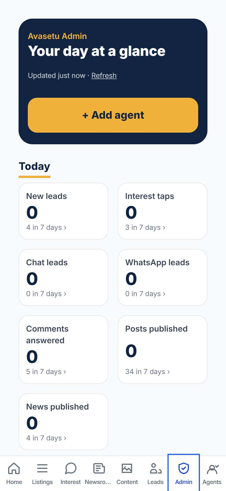
2. **Today.** Seven count tiles: new leads, interest taps, chat leads, WhatsApp leads, comments answered, posts published and news
   published. The big number is today (since midnight, India time) and the line under it is the last 7 days. Tap a tile to open the
   screen the number comes from: **Leads**, **Interest**, **Content** or **Newsroom**.
    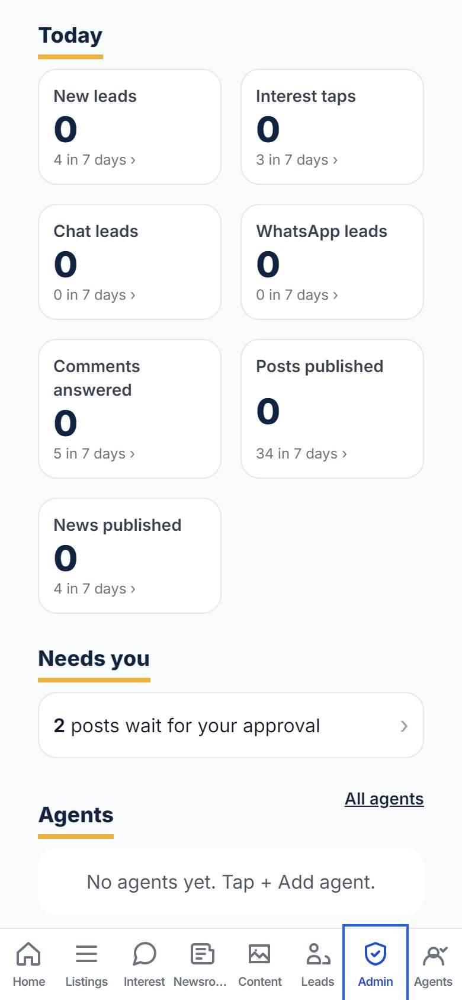
3. **Needs you.** Posts that wait for approval (tap to open **Content**), news stories to review (tap to open **Newsroom**), and people
   who asked to join on the site/request-invite. Each request shows the name, a masked number (like `90******17`), the city and their note,
   with two buttons:
   - **Invite** makes his login, his page and his code at once, and shows the code and the WhatsApp message to send (like Add agent).
     The request then disappears and he appears under **Agents**.
   - **Dismiss** asks "Yes, dismiss" or "Keep" first, so a stray tap does nothing.
    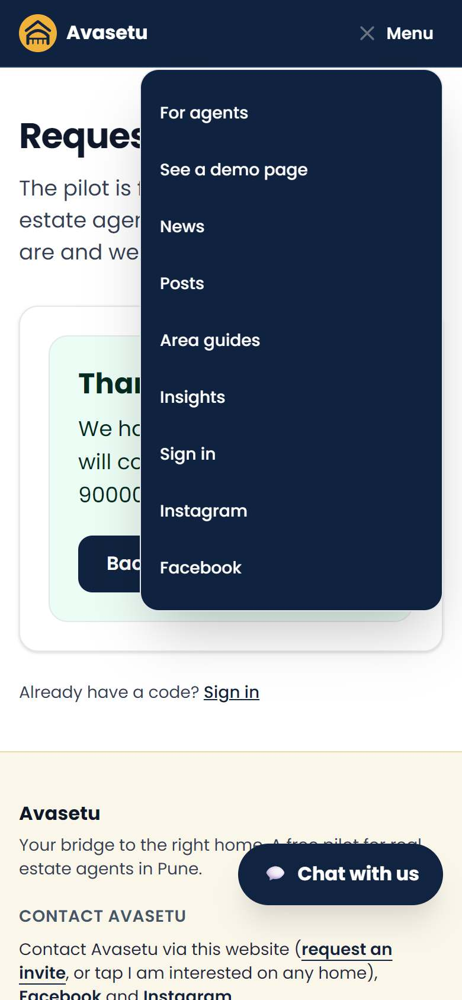 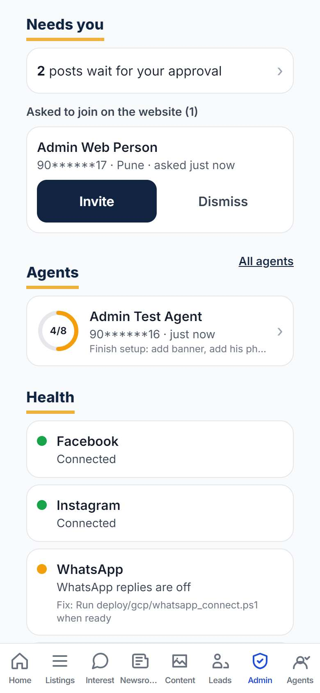 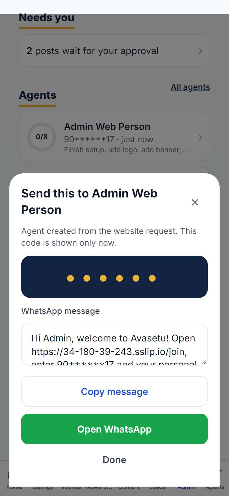
4. **Agents.** Everyone set up so far, with a ring (steps done out of 8), the masked number, when he was last active, and what is left,
   for example "Finish setup: add logo, add banner, add RERA number". Tap a row to open his detail screen (brand, listings, consent).
   **All agents** opens the full Agents tab.
    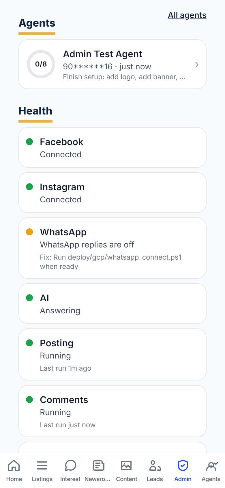 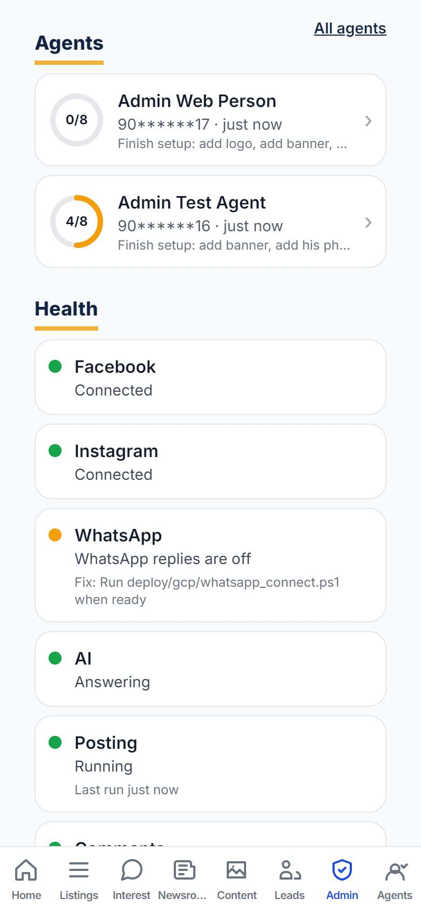
5. **Health.** One row each for Facebook, Instagram, WhatsApp, AI, Posting, Comments and News. **Green** means working. **Amber** means
   switched off, paused or in practice mode (nothing is really sent). **Red** means broken. Amber and red rows say what is wrong. The fixes
   for red rows are done by our operator, not by you: take a screenshot and send it to the owner.
    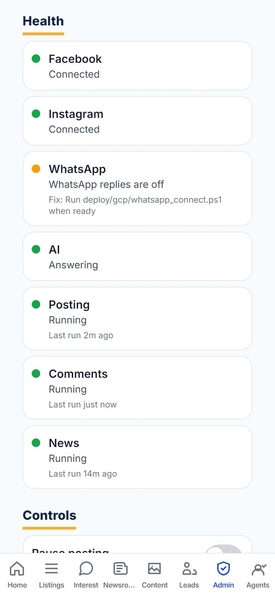
6. **Controls.** Three switches: **Pause posting** (scheduled Facebook and Instagram posts), **Pause comment replies** (the comment
   assistant) and **Pause news** (collecting, drafting and posting news). Each switch first tells you what will happen and asks
   "Yes, pause posting" or **Cancel**. While posting is paused, the Health row says "Paused by you" and nothing scheduled goes out.
   Switch it back the same way ("Yes, resume posting"). Posts that came due while paused go out on the next run.
   ✅ Pause and resume posting were tested. ⚠️ Pause comment replies and Pause news were not switched in the test (they work the same way).
   **Use a pause when something looks wrong in public** (a bad post, a wrong reply), then tell the owner.
    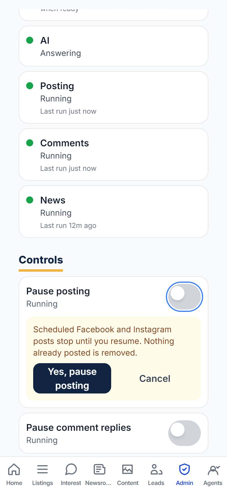 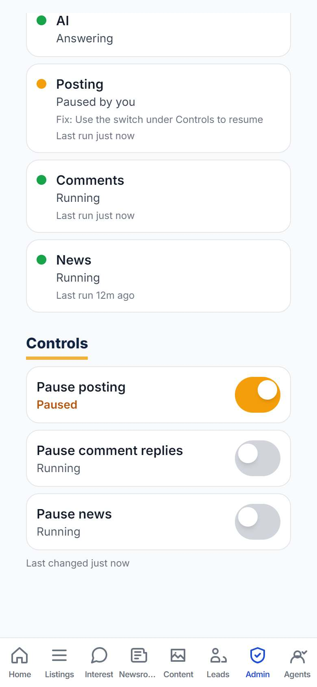

---

## 5. Showcase in 5 minutes ✅

Before the meeting: phone charged and on mobile data; open the site/for-agents once so it loads fast later; know the agent's WhatsApp
number and his main areas.

Hand him your phone, or share your screen on a WhatsApp video call. Open these links in this order. All of them loaded without errors in
the test run (each in under 4 seconds).

| # | Open | What to say |
|---|---|---|
| 1 | the site/**for-agents** | "Avasetu is free for Pune agents during the pilot. You add a home from your phone. You get your own page, ready-made posts, and every buyer who shows interest becomes a lead card." |
| 2 | the site/**agent/demo** | "This is what **your** page looks like: your name, logo and colours, and only your homes. It is a demo, so the homes are marked Sample." |
| 3 | Tap a home on the demo page, then **Chat with us** | "Buyers ask questions here at any hour. The chat answers from your listing. With the buyer's permission, it takes his number and sends you a lead with his budget, BHK and area." |
| 4 | the site/**agent/avasetu** | "This is our own page. When you agree, your homes also go on the Avasetu Facebook Page and Instagram with **your** name and RERA number, and buyers reach you." |
| 5 | the site/**go** | "This is the link from our Instagram bio. It lists the latest homes and posts." |
| 6 | the site/**news** | "Local property news in plain words, which you can share with buyers." |
| 7 | Instagram: **instagram.com/avasetu_** (linked from the for-agents page) | "Our Instagram, where your homes will appear." |
| 8 | the site/**request-invite** | Only if he wants to sign up later on his own. Do not fill it in for him if you will set him up now. |

  

**Short lines that work**
- हिंदी: "आपका अपना पेज, आपके नाम और लोगो के साथ। प्रॉपर्टी फ़ोन से डालिए, पोस्ट तैयार मिलेंगी, और हर खरीदार एक लीड कार्ड बनकर आपके पास आएगा। पायलट में बिल्कुल मुफ़्त।"
- मराठी: "तुमचं स्वतःचं पेज, तुमच्या नावाने आणि लोगोसह. प्रॉपर्टी फोनवरून टाका, पोस्ट तयार मिळतील, आणि प्रत्येक खरेदीदार लीड कार्ड म्हणून तुमच्याकडे येईल. पायलटमध्ये पूर्ण मोफत."

Close with: "Shall I make your page now? It takes 10 minutes."

---

## 6. Onboard an agent

### What to collect from him (send this as one WhatsApp message)

> Namaste {name} ji, to set up your Avasetu page please send:
> 1. Your **logo** (square) and a **banner** photo (wide: your office or a skyline is fine)
> 2. A clear **photo of yourself**
> 3. Your **business name** and a **colour** you like (or your logo's colour)
> 4. One line about you (**tagline**) and 2 to 3 lines **about you** (years, areas, what you are known for). No phone numbers or links in these.
> 5. Your **MahaRERA agent registration number** (it starts with A)
> 6. The **areas** you work in (up to 6 in Pune) and the **languages** you speak
> 7. For each home: locality and project name, BHK, carpet area, price, possession, floor, furnishing, amenities, **3 to 6 real photos**,
>    and what buyers always ask (parking, maintenance, water, power backup, nearby schools and offices)
> 8. Please reply **"I agree"** to this: *I agree that Avasetu may feature me and my listings on the Avasetu Facebook Page, Instagram and website, with my name and RERA number, and that buyers' interest comes to my inbox.*

Rules the app enforces (you will see an error if you break them): text fields reject phone numbers, links and e-mail addresses. The
business name can be up to 60 characters and the tagline up to 90. Areas must be in Pune. The RERA number is "A" followed by digits.
We show it as "stated by the agent" and never call him "verified".

### Way 1. You set him up (Admin → + Add agent) ✅

If he already asked on the site/request-invite, use **Invite** on his request under Admin → **Needs you** instead of steps 1 and 2: it
does the same and gives you the same code and message.

1. **Studio → Admin → + Add agent.** Fill in his name, his 10-digit mobile number, and a label for yourself (for example "Rahul, Baner").
   Tap **Create agent**. *(about 1 s)* The same sheet is also under Studio → Agents → + Add agent.
    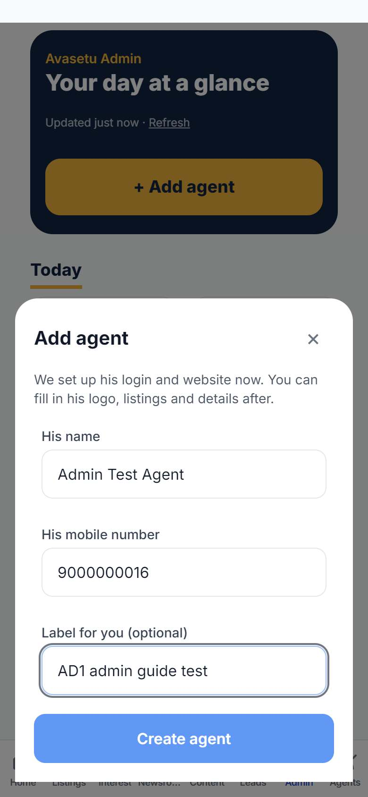 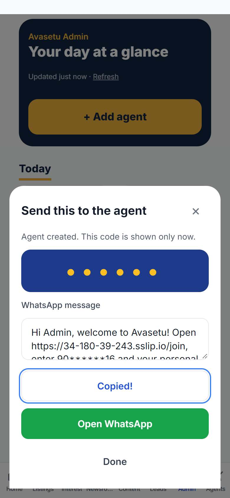
2. The sheet shows his **6-digit code** (shown **only now**) and a ready message:
   *"Hi Rahul, welcome to Avasetu! Open (the site)/join, enter (his number) and your personal code (code). Please don't share it."*
   Tap **Copy message**, then **Open WhatsApp** (or paste the message into his chat). Then tap **Done**. ⚠️ The test did not open
   WhatsApp; sending the copied message by hand works the same way. The greeting uses the first word of the name you typed.
3. Tap his row under Admin → **Agents**. You see his **Setup checklist** (logo, banner, RERA number, areas, photo, first listing,
   3 listings, consent) and the ring (0/8).
    
4. **Brand:** fill in the business name and tagline, tap his areas, upload his logo, type his RERA number, then tap **Save my brand**.
   ✅ (logo, name, tagline, areas and RERA were tested. ⚠️ Banner and his photo were not uploaded in the test, but they use the same picker.)
    
5. **Add listing for {him}:** the same three steps as in section 7 (type it, About the project, check and confirm). You see
   "Saved for {him}". *(about 9 s)*
     
6. **Consent:** only after he has replied "I agree" on WhatsApp, switch **"{He} has agreed"** on. Until then, Avasetu will not post his
   homes. Keep his WhatsApp reply; do not delete that chat.
    
7. **Preview {his} page:** read it as a buyer would. Check spelling, price, photos and areas.
    
8. **Post to Avasetu** (on the listing): the screen first shows the **exact** Facebook and Instagram text. Check for
   "Listed by {his business} on Avasetu" and "RERA agent reg: {number}", and his interest link. There is no phone number. Then tap
   **Approve and post for {him}**. ✅ Tested up to the caption preview. ⚠️ **Approve and post was not tapped** in the test, so nothing
   was posted. If the Health row for Posting says "practice mode", nothing really goes out yet.
    

Tell him plainly: "Your homes appear on our pages with your name. Buyers reach you through your link and your Interest tab. We do not
post from your own Facebook or Instagram yet."

### Way 2. He signs up and does the typing himself

1. He asks to join on **the site/request-invite** (name, mobile, city, a note). Or you send him that link.
2. His request appears under Admin → **Needs you**. Tap **Invite**. ✅ You get his code and the ready WhatsApp message. Send it to him.
3. He opens **the site/join**, waits a second for the page to load, enters his mobile number and taps **Send OTP**. The next screen asks
   for **"your 6-digit invite code"**. He types the code from your message and is signed in. ✅ (sign-in tested)
     
4. Because **Invite** already made his page, he lands in **Studio**. ⚠️ (This first sign-in after Invite was not run in the test.) If he
   is asked **"Tell us about you"** instead, he fills in name, city **Pune**, business name, a colour theme and languages, then
   **Create my website**.
     
5. On Studio Home he taps **My brand** to add his tagline, areas, logo, banner, photo, languages and RERA number, then **Save my brand**.
   He sees "Saved. Your site now shows this look." ✅
      
   Note: "Years in property" shows a grey **9** as an example. That field is empty until he types in it.
6. Consent and **Post to Avasetu** still go through you: steps 6 to 8 of Way 1, from his row under Admin → Agents.

You never need to run anything on a computer. If a case does not fit these two ways (for example he wants a code without a ready-made
page), ask the owner: our operator can issue one for you.

---

## 7. His first listing and first leads ✅

### Add the listing (about 1 minute)
1. Studio → **+ Add listing**. He types it the way he would say it, for example:
   *"2 BHK Kharadi 85 lakh ready to move, 950 sq ft carpet, 7th floor, parking, gym"*
   Then he taps **Add photos**, picks 2 to 6 photos and taps **Next**. The AI read this in about 8 seconds in the test.
    
2. **About the project and area** (optional, but it helps the chat answer buyers): tap **Suggest from my description and the area guide**,
   check the suggestions (green "Area guide" means the line came from our guide, blue "You said" means it came from his words), tap
   **Keep all** or **Remove** on any line that is not true, then **Continue**.
     
3. **Check and confirm:** fix anything that is wrong (area, BHK, size, floor, price, possession). If the price looks unusual, tick
   "Yes, this price is correct". Then tap **Confirm & post**. He sees "Your property is ready". *(about 4 s)*
     

### Share it (the marketing pack)
4. Listings → the listing → **Marketing**. It has ready cards and captions in **EN / HI / MR**, with "Listed by {business} · RERA {no}"
   on the card. He shares them to WhatsApp Status, groups, Instagram or Facebook. *(The first time it takes about 10 s to make the cards.)*
   ⚠️ Only the English tab was opened in the test.
    
5. His page: the site/agent/{his-name}, and the listing page. Tell him to share the **listing page link**, not only the photos.
     

### Where the first leads show up
6. A buyer on his listing page taps **Chat with us** and asks a question. The chat answers from the listing, and asks for the buyer's
   number with a consent sentence next to it. When the buyer types his number he gets "Thank you! Our team will contact you soon."
     
7. In his Studio, all of these show up straight away:
   - **Home:** a green badge "**1** New lead or chat from your website".
   - **Leads:** the lead card (for example "Website visitor · 2 BHK · under 90L · Kharadi") with the buyer's number and the chat summary.
   - **Interest → Website chats:** the conversation, marked "lead saved".
   - **The lead itself:** an AI summary, **Call** and **WhatsApp** buttons, and his matching homes.
       

Tell him: "Check **Home** every morning. The green badge means someone wants you. Call the buyer the same day."

---

## 8. Day-7 check-in and the tracking sheet

A 10-minute call (or WhatsApp voice notes) one week after his first listing. Ask, and write down the answers:
1. Did you post a listing? How long did it take? What confused you?
2. Did you share the cards? Where (WhatsApp Status, groups, Instagram, Facebook)?
3. Did anyone enquire? How (chat, form, comment, WhatsApp)? Was the summary useful?
4. What would make you post your **next** home here, and not only on WhatsApp?
5. If this saved you an hour a day, what would you pay per month?

**Success measure:** he adds a **second listing within 7 days** of the first, **without being asked**. Check it in Admin → Agents (the
ring and the "3 listings" item) or on his page.

**Tracking sheet (one row per agent).** Keep it in a shared sheet with the owner:

| Column | What to write |
|---|---|
| Agent | His name or business (no phone number in the sheet) |
| Area | His main area |
| Invited on | Date you sent the code |
| First listing on | Date |
| Listings after 14 days | Number |
| Photos on listings | Yes / some / no |
| Enquiries | Number, and where from |
| Site visits | Number he tells you |
| Second listing within 7 days | Y / N |
| Main complaint | His words |
| Would pay (₹/month) | His answer |

---

## 9. Your daily routine (5 to 10 minutes)

1. **Admin → Needs you.** Invite or dismiss people who asked to join. Open **Content** for posts waiting for approval and **Newsroom** for
   news to review. Read every post as a buyer would: no phone numbers, no invented facts, samples labelled. Approve only what is right;
   skip the rest. ⚠️ (The Content and Newsroom screens were not part of the guide run.)
2. **Admin → Health.** All green or amber is fine. If anything is **red**, take a screenshot and send it to the owner before anything is
   posted.
3. **Admin → Today.** Look at new leads and chat leads. If an agent got a lead and has not been active, remind him on WhatsApp to call
   the buyer.
4. **Admin → Agents.** Pick one agent whose ring is low and help him with the next item ("add banner", "add first listing").
5. If something wrong went out in public, **pause** it under **Controls** first, then tell the owner. To take down a post that is already
   on Facebook or Instagram, the owner removes it there; the app does not delete posts.

---

## 10. Troubleshooting

| Problem | What to do |
|---|---|
| **"Incorrect code"** ✅ | He typed the code wrong. He clears the box and types the 6 digits again.   |
| **"Too many wrong attempts"** or **"This invite is locked"** ⚠️ | After 5 wrong codes the number is locked for 30 minutes. After 15 it stays locked until a new code is made. Make one: Admin → **+ Add agent** with his name and number. The sheet says "{name} is already added"; tap **Make a new code** and send the new message. The old code stops working. (Not tested: only one wrong code was tried.) |
| **"Signup is by invitation"** ✅ | That number has no invite. Check you typed his number correctly, then use Add agent (or Invite on his request). |
| **The page jumps back after "Send OTP"** ✅ | The page had not finished loading. Wait a second and tap again. |
| **He lost his code** ⚠️ | Admin → **+ Add agent** with his number, then **Make a new code** (as above). Codes are shown only once and stored scrambled, so nobody can look up the old one. |
| **His page does not show a change** ✅ | Pages refresh about 30 seconds after a change, and the first visit after a change can still show the old page. Wait a minute, then reload. |
| **Photo upload fails** ⚠️ | Use JPG or PNG photos from the phone camera, a few at a time. On weak mobile data, try again on Wi-Fi. If one keeps failing, send a screenshot of the error to the owner. |
| **"Record the agent's consent"** on Post to Avasetu | Consent is not switched on. Switch it on only if he has replied "I agree". |
| **"Lists homes in Pune for now"** | The city or area is outside Pune. We only list Pune homes during the pilot. |
| **No leads** | Check the listing is **live** (Listings tab). Share the **listing page** link, not only photos. Open the chat on his listing yourself to check it answers. Leads only come when the buyer gives his number. Questions without a number appear under **Interest → Website chats**. |
| **His post is not on Facebook or Instagram** ⚠️ | We post only on the **Avasetu** Page and Instagram, never his own accounts. It needs his consent and your Approve and post. If the Health row for Posting says "practice mode", nothing really goes out yet. Instagram posts say "link in our bio": check the site/go. |
| **A Health row is red** | Screenshot it and send it to the owner. Our operator fixes connections and keys. Do not approve posts until it is green or amber. |
| **You do not see Admin or Agents** | Your account does not have partner rights yet. Ask the owner. |
| **Someone asks us to delete their data** | Send the owner his request (name, number, what he asked). The site/data-deletion page explains the process; we reply within 30 days. |
| **The site does not open** | Try mobile data and Wi-Fi. If it is still down, tell the owner. |
